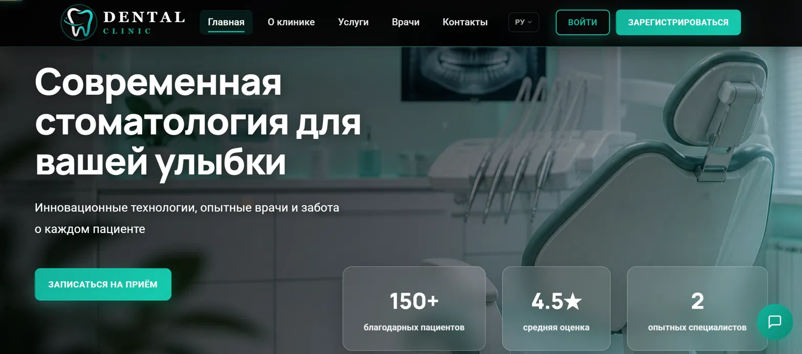
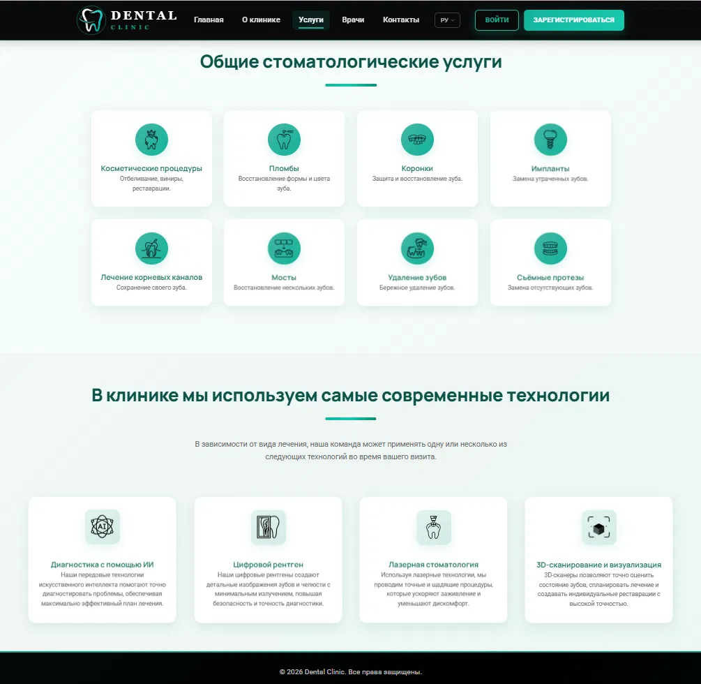
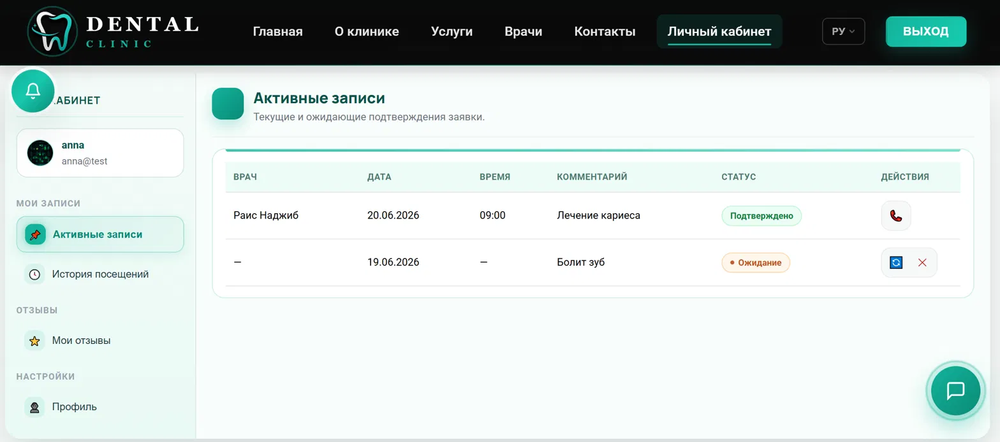
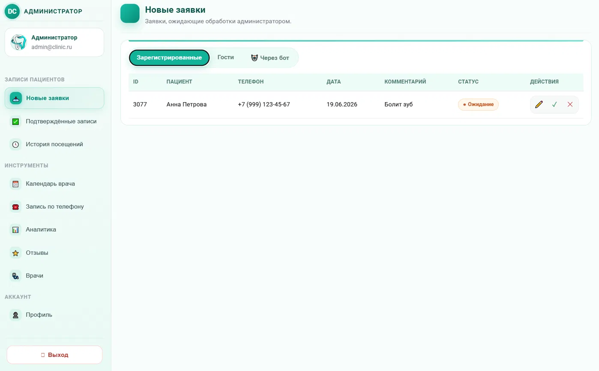
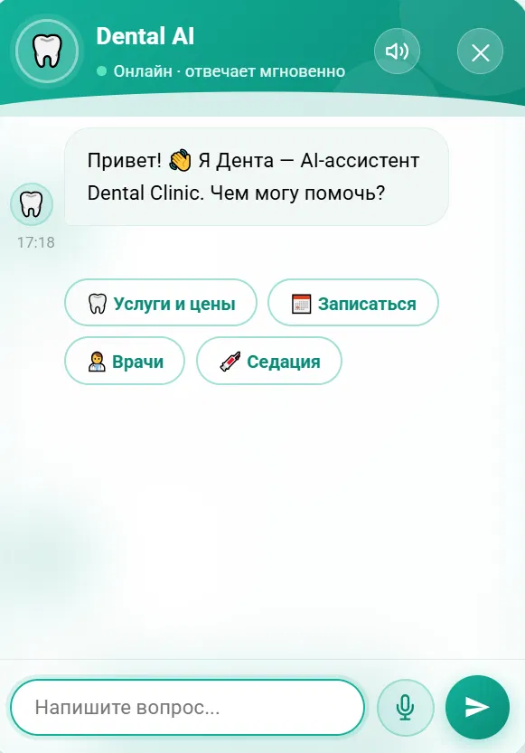
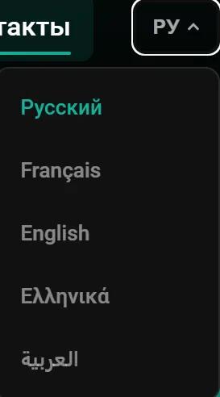

<div align="center">

# 🦷 DentalClinic

### A dental clinic web platform: website + CRM + AI assistant

<p>
  <a href="README.en.md"></a>
  <a href="README.md"></a>
</p>

<p>
  
  
  
  
  
  
  <br/>
  
</p>

A full-featured web application for a dental clinic: a public website with online booking,
a patient dashboard, an admin panel, an AI assistant with voice replies, and a 5-language UI.

**[🌐 Live Demo](#-live-demo) · [📖 Documentation](#-documentation) · [🚀 Quick Start](#-quick-start) · [🖼 Screenshots](#-screenshots) · [🏗 Architecture](docs/en/ARCHITECTURE.md) · [👤 Author](#-author)**

</div>

---

## 🌐 Vercel deployment

Target production domain:

### 👉 [dental-clinic-vn.vercel.app](https://dental-clinic-vn.vercel.app/)

> The server is deployed as an ASP.NET Core container service on Vercel. Before the
> first production start, configure the database and secrets documented in
> [`docs/en/DEPLOYMENT.md`](docs/en/DEPLOYMENT.md); the app intentionally refuses to
> start without them.

**Test credentials to try out the functionality:**

| Role | Email | Password |
|---|---|---|
| 🧑‍⚕️ Patient | `anna@test` | `123` |
| 👑 Administrator | `admin@admin` | `123` |

*These are demo accounts for exploring the project — please don't enter real personal
data when using them.*

**UI languages:** the site fully supports 5 languages — 🇷🇺 Russian, 🇬🇧 English,
🇬🇷 Greek, 🇸🇦 Arabic, 🇫🇷 French — switching is instant, with no page reload, via the
language button in the header.

## 📑 Table of Contents

- [Live Demo](#-live-demo)
- [About the project](#-about-the-project)
- [Features](#-features)
- [Tech stack](#-tech-stack)
- [Quick start](#-quick-start)
- [Environment variables](#-environment-variables)
- [Documentation](#-documentation)
- [Screenshots](#-screenshots)
- [Known limitations & roadmap](#-known-limitations--roadmap)
- [Author](#-author)
- [License](#-license)

## 📌 About the project

DentalClinic is a full-stack web platform for a dental clinic, built for a practicing
dentist. The project covers the full cycle: from gathering and agreeing on requirements
with the client to development, deployment, and ongoing maintenance.

Technically, it's an ASP.NET Core backend with custom JWT authentication and a REST API,
a relational database via EF Core, a realtime layer built on SignalR, and integrations
with external AI services — plus a responsive, framework-free frontend (plain
HTML/CSS/JS) supporting 5 languages.

The project demonstrates hands-on experience with:

- 🏗 designing a REST API and a layered ASP.NET Core architecture (Controllers → Services → Data);
- 🗄 EF Core: migrations, indexes, cascade deletes, seeding initial data;
- 🔐 JWT-based authentication/authorization for two roles (patient / admin), password hashing (BCrypt);
- ⚡ realtime communication via SignalR (instant notifications, no polling);
- ⏱ background jobs (`BackgroundService`) — appointment reminders, stale-request cleanup;
- 🤖 integrating external AI APIs (Google Gemini for chat & translation, ElevenLabs for voice);
- 🛡 security practices: rate limiting, CORS, global exception handling, separating secrets from code;
- 🌍 UI localization (i18n across 5 languages) with no third-party libraries — the clinic
  serves Russian-, English-, Greek-, Arabic-, and French-speaking patients.

## ✨ Features

### 🌐 For website visitors
- Book an appointment online without registering
- Service catalogue with prices, doctors page, patient reviews
- Multilingual UI: 🇷🇺 Russian · 🇬🇧 English · 🇫🇷 French · 🇬🇷 Greek · 🇸🇦 Arabic
- "Denta" AI assistant — answers questions about prices/doctors/services (data is pulled
  from the database live, not hardcoded into the prompt), can read its answer out loud

### 🧑‍⚕️ For patients (dashboard)
- Sign up / log in, edit profile and avatar
- Appointment history, status, reschedule/cancel
- Leave a rated review, reviews are auto-translated into the reader's language
- Realtime notifications about appointment status (SignalR, no page reload)

### 👑 For administrators
- Moderate appointment requests (confirm/cancel/book by phone)
- Manage doctors and the service price list
- Moderate patient reviews with a rejection reason
- Period statistics and export to Excel / a printable report
- Monitor AI chatbot sessions and usage stats

### ⚙️ Background processes
- Automatic reminder to the patient 24 hours before the appointment
- Automatic cleanup of expired unconfirmed requests

## 🛠 Tech stack

| Layer | Technologies |
|---|---|
| **Backend** | ASP.NET Core 9 (Web API), C# |
| **Data** | Entity Framework Core 9, SQL Server |
| **Auth** | JWT Bearer, BCrypt.Net (password hashing) |
| **Realtime** | SignalR |
| **AI integrations** | Google Gemini API (chat + translation), ElevenLabs API (TTS) |
| **Frontend** | HTML5, CSS3 (ITCSS-like structure), Vanilla JS (modular architecture, ES modules) |
| **API docs** | Swagger / Swashbuckle |
| **Infrastructure** | Rate Limiting, Response Compression, CORS, i18n (5 languages) |

## 🚀 Quick start

```bash
git clone https://github.com/ViolettaNcl/DentalClinic.git
cd DentalClinic

# 1. Copy the example config and fill in your own values
cp appsettings.Example.json appsettings.json

# 2. Restore dependencies
dotnet restore

# 3. Apply EF Core migrations
dotnet ef database update

# 4. Run the app
dotnet run
```

The site will be available at the address from `Properties/launchSettings.json` (usually
`https://localhost:7063`). In Development mode, Swagger UI is available at `/swagger`.

📖 For details — configuring secrets via `dotnet user-secrets`, environment requirements,
project structure — see [`docs/en/DEVELOPER_GUIDE.md`](docs/en/DEVELOPER_GUIDE.md).

> ⚠️ **Before your first publish to GitHub**, please read
> [`docs/en/SECURITY.md`](docs/en/SECURITY.md) — it explains how to safely store secrets
> (DB password, JWT key, API keys) and avoid leaking them into a public repository.

## 🔑 Environment variables

Full template — in [`appsettings.Example.json`](appsettings.Example.json). Key settings:

| Key | Description | Required |
|---|---|---|
| `ConnectionStrings:DefaultConnection` | SQL Server connection string | ✅ |
| `Jwt:Key` | Secret key for signing JWTs (min. 32 chars, random string) | ✅ |
| `Jwt:Issuer` / `Jwt:Audience` | Token issuer/audience | ✅ |
| `Jwt:ExpiryMinutes` | Token lifetime in minutes | — (defaults to 120) |
| `Gemini:ApiKey` | Google Gemini API key for AI chat & translation | ✅ |
| `ElevenLabs:ApiKey` | ElevenLabs API key for bot voice replies | — (TTS is disabled without it) |
| `Clinic:*` | Clinic contact details shown on the site | ✅ |
| `AllowedOrigins` | Domains allowed to access the API (CORS) | ✅ |
| `BackgroundJobs:*` | Reminder & cleanup job settings | — (has sensible defaults) |

## 📚 Documentation

| Document | Audience | Description |
|---|---|---|
| [`docs/en/ARCHITECTURE.md`](docs/en/ARCHITECTURE.md) | everyone | System architecture, diagrams, database structure |
| [`docs/en/API.md`](docs/en/API.md) | developers | Reference for all REST endpoints |
| [`docs/en/DATA_DICTIONARY.md`](docs/en/DATA_DICTIONARY.md) | developers | Full database field dictionary, constraints, state diagrams |
| [`docs/en/USER_GUIDE.md`](docs/en/USER_GUIDE.md) | patients / clients | How to book an appointment, use the dashboard |
| [`docs/en/ADMIN_GUIDE.md`](docs/en/ADMIN_GUIDE.md) | clinic administrator | Working with the admin panel |
| [`docs/en/DEVELOPER_GUIDE.md`](docs/en/DEVELOPER_GUIDE.md) | developers | Setup, configuration, code structure |
| [`docs/en/DEPLOYMENT.md`](docs/en/DEPLOYMENT.md) | developers / DevOps | Publishing to a server/hosting |
| [`docs/en/SECURITY.md`](docs/en/SECURITY.md) | everyone | Implemented security measures, secrets management |
| [`docs/DentalClinic.postman_collection.json`](docs/DentalClinic.postman_collection.json) | developers | A ready-made Postman collection for all endpoints |

🇷🇺 Русская версия всех документов — в корне репозитория и в [`docs/`](docs/).

## 🖼 Screenshots

<table>
<tr>
<td width="50%">

**Home page**


</td>
<td width="50%">

**Service catalogue**


</td>
</tr>
<tr>
<td width="50%">

**Patient dashboard**


</td>
<td width="50%">

**Admin panel**


</td>
</tr>
<tr>
<td width="50%">

**"Denta" AI assistant**


</td>
<td width="50%">

**Multilingual UI**


</td>
</tr>
</table>

## 🧰 Developer tooling

Beyond the documentation itself, the repository already includes:

- **CI** (`.github/workflows/ci.yml`) — GitHub Actions automatically builds the project
  on every push and Pull Request — status shown by the badge at the top of this README
- **A Postman collection** (`docs/DentalClinic.postman_collection.json`) — a ready set of
  requests for every endpoint, for manual API testing
- **`.editorconfig`** — consistent code formatting rules (indentation, C#/JS style)

## 🧭 Known limitations & roadmap

This project was built for a real client, but not for production-scale traffic across
thousands of users — so some architectural choices are intentionally simplified for the
current scale of a single clinic. Here's an honest list of what's worth improving as it grows:

- [ ] No automated tests (unit/integration) yet — currently verified manually via Swagger/UI
- [ ] CI is in place (auto-build on push/PR), but there's no CD yet — production deploys are still manual
- [ ] Avatar uploads are stored on the server's local disk rather than object storage (S3/Blob) — scaling to multiple servers would require shared storage
- [ ] Rate limiting is in-process, per IP — horizontal scaling (multiple instances) would need a shared store (e.g. Redis)
- [ ] No "second admin / super-admin" role — only a flat patient/admin split

This also doubles as a ready-made task list if the project keeps growing alongside the clinic.

## 👤 Author

**Violetta Nicolaou** (Николау Виолетта) — Full-stack developer

- GitHub: [@ViolettaNcl](https://github.com/ViolettaNcl)

If this project was useful, consider starring ⭐ the repository — it helps with portfolio visibility.

## 📄 License

Distributed under the [MIT License](LICENSE) — use, modify, and publish freely.

---

<div align="center">
Built for a real client — a dental practice · questions and suggestions via Issues
</div>
