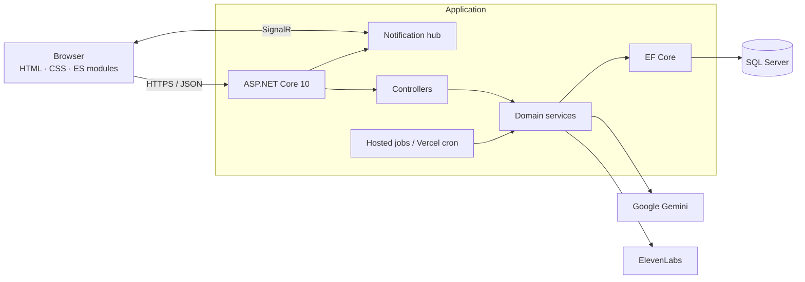

<div align="center">



<br>

<a href="README.md"></a>
<a href="README.ru.md"></a>

<br><br>

<a href="https://dental-clinic-vn.vercel.app/"></a>
<a href="docs/README.md"></a>
<a href="docs/en/ARCHITECTURE.md"></a>
<a href="docs/en/API.md"></a>
<a href="docs/en/SECURITY.md"></a>

<br><br>

[](https://github.com/ViolettaNcl/DentalClinic/actions/workflows/ci.yml)
[](https://github.com/ViolettaNcl/DentalClinic/actions/workflows/codeql.yml)
[](https://github.com/ViolettaNcl/DentalClinic/actions/workflows/production-smoke.yml)
[](https://dotnet.microsoft.com/)
[](LICENSE)
[](https://github.com/ViolettaNcl/DentalClinic/stargazers)

</div>


<details>
<summary><strong>✨ Explore the DentalClinic system</strong></summary>

<br>

| Area | Open |
|---|---|
| 🏗 Architecture | [System design, trust boundaries and data flow](docs/en/ARCHITECTURE.md) |
| 📡 API | [REST API reference](docs/en/API.md) |
| 🔒 Security | [Controls, boundaries and residual risks](docs/en/SECURITY.md) |
| 👨‍💻 Developer Guide | [Local setup, migrations and tests](docs/en/DEVELOPER_GUIDE.md) |
| 🚀 Deployment | [Vercel, Docker and release checks](docs/en/DEPLOYMENT.md) |
| 👤 Patient Guide | [Visitor and patient workflows](docs/en/USER_GUIDE.md) |
| 👑 Administrator Guide | [Clinic and super-admin operations](docs/en/ADMIN_GUIDE.md) |

</details>

## What this project demonstrates

DentalClinic is an end-to-end clinic operations system, not a static landing-page demo. It covers the workflows that connect a patient request to administrative scheduling, durable notifications, reporting, and post-visit follow-up.

| Product area | Capabilities |
|---|---|
| Public experience | Service catalogue, doctor profiles, reviews, contact/map experience, guest appointment requests, five UI languages including Arabic RTL |
| Patient workspace | Registration and secure sessions, profile/avatar management, appointment history, rescheduling and cancellation rules, reviews, realtime notifications |
| Clinic operations | Appointment CRM, doctor and service management, schedule availability, review moderation, analytics, XLSX and printable exports |
| Administration | Multiple administrator accounts, super-admin safeguards, password resets, role changes, and last-super-admin protection |
| Denta assistant | Database-backed clinic knowledge, structured Gemini responses, local link allow-listing, safe booking hand-off, optional ElevenLabs speech |
| Automation | Appointment reminders and follow-ups; opt-in stale-request cancellation; chat-data retention through a protected cron endpoint |

## Engineering highlights

- **Protected browser sessions:** signed JWTs travel in `HttpOnly`, `SameSite=Strict` cookies. Password and access changes increment a stored token version; other instances observe the change after their short-lived cache expires. Tokens stay out of JavaScript storage and URL query strings.
- **Defense in depth:** same-origin enforcement for state-changing and paid-AI routes, CORS allow-lists, production rate limits, SQL-backed distributed quotas, security headers, bounded payloads, and file-signature validation.
- **Data integrity:** EF Core migrations, database check constraints and indexes, serializable scheduling operations, conflict detection, idempotency keys, and guarded cross-role email uniqueness.
- **Reliable realtime UX:** SignalR delivers patient/admin events while REST remains the source of truth for initial state and reconnect recovery.
- **AI with an application boundary:** deterministic clinic facts are resolved from SQL/configuration first; Gemini handles bounded natural-language work behind structured-output and healthcare-safety rules.
- **Operational verification:** .NET integration/unit tests, Node regression tests, Playwright production E2E, CodeQL, container builds, health checks, and scheduled production smoke tests.

## Architecture at a glance



The application is a modular monolith: one deployable ASP.NET Core service owns the static frontend, REST API, SignalR hub, background workflows, and database access. See the [architecture guide](docs/en/ARCHITECTURE.md) for trust boundaries, request flows, and design decisions.

## Technology stack

| Layer | Technology |
|---|---|
| Backend | C#, ASP.NET Core 10, REST controllers, hosted services |
| Persistence | Entity Framework Core 10, SQL Server, code-first migrations |
| Authentication | JWT Bearer validation, secure cookie transport, BCrypt password hashing |
| Realtime | ASP.NET Core SignalR |
| AI | Google Gemini structured generation and translation, optional ElevenLabs TTS |
| Frontend | Semantic HTML, modular vanilla JavaScript, component/page CSS, JSON i18n |
| Delivery | Docker, Vercel container service, GitHub Actions, GHCR, optional FTPS fallback |
| Quality | xUnit, `WebApplicationFactory`, Node test runner, Playwright, axe-core, CodeQL |

## Quick start

### Prerequisites

- [.NET SDK 10](https://dotnet.microsoft.com/download/dotnet/10.0)
- SQL Server 2019+ or Azure SQL
- Git
- Optional: Node.js 22 for frontend/E2E tests; Docker Desktop for the container workflow

### Run with the .NET SDK

```bash
git clone https://github.com/ViolettaNcl/DentalClinic.git
cd DentalClinic
dotnet tool restore
cp appsettings.Example.json appsettings.json
```

On PowerShell, use `Copy-Item appsettings.Example.json appsettings.json` instead of `cp` if preferred. Replace the example database, JWT, origin, and clinic-profile values before continuing; real secrets must never be committed.

```bash
dotnet restore
dotnet ef database update
dotnet run
```

The launch profiles expose `http://localhost:5192` and `https://localhost:7063`. Swagger UI is available at `/swagger` in Development.

### Run with Docker Compose

```bash
cp .env.example .env
# Replace every placeholder in .env.
docker compose up --build
```

The application is served at `http://localhost:8080`; SQL Server is exposed at `localhost:1433`. Detailed setup and troubleshooting are in the [developer guide](docs/en/DEVELOPER_GUIDE.md).

## Configuration

ASP.NET Core environment variables use `__` for nested keys, for example `Jwt__Key`.

| Setting | Purpose | Requirement |
|---|---|---|
| `ConnectionStrings__DefaultConnection` | SQL Server connection | Required |
| `Jwt__Key` | HMAC signing secret, at least 32 UTF-8 bytes | Required |
| `Jwt__Issuer`, `Jwt__Audience` | Token validation boundaries | Required |
| `AllowedOrigins__0` | Trusted browser origin | Required outside same-origin defaults |
| `Clinic__*` | Public clinic contact details and optional coordinates | Required for production content |
| `Scheduling__*` | Time zone, opening hours, slot interval, duration, lead time | Recommended |
| `Gemini__ApiKey` | Denta and translation provider access | Required for AI features |
| `ElevenLabs__ApiKey` | Voice responses | Optional |
| `CRON_SECRET` | Vercel maintenance endpoint authentication | Required on Vercel |

Use `appsettings.Example.json` only as a schema/example. See [Security](docs/en/SECURITY.md) before configuring any shared or production environment.

## Testing

```bash
dotnet test DentalClinic.Tests/DentalClinic.Tests.csproj --configuration Release
npm install
npm run test:js
npx playwright install chromium
npm run test:e2e
```

Playwright targets the deployed site by default. Set `BASE_URL` to target another approved environment; some canonical-URL checks still expect the production domain.

## Operational boundaries

Denta and the Smile Meter are informational features, not diagnostic or treatment-planning tools. Deployment requires operator-managed secrets, an external database, and separately provisioned administrator access. The current implementation has no administrator MFA or password-recovery flow, and multi-instance SignalR delivery needs additional infrastructure. See [Security](docs/en/SECURITY.md) for session-revocation, upload, proxy, and retention limitations.

## Documentation

The [documentation hub](docs/README.md) separates durable reference material from historical engineering records.

| Guide | Scope |
|---|---|
| [Architecture](docs/en/ARCHITECTURE.md) | Components, trust boundaries, data flow, deployment model, design decisions |
| [API reference](docs/en/API.md) | Current routes, access rules, session model, limits, error behavior |
| [Data dictionary](docs/en/DATA_DICTIONARY.md) | Entities, constraints, indexes, retention, state machines |
| [Developer guide](docs/en/DEVELOPER_GUIDE.md) | Setup, configuration, migrations, tests, change workflow |
| [Deployment guide](docs/en/DEPLOYMENT.md) | Vercel, Docker, database migrations, cron, release checks |
| [Security](docs/en/SECURITY.md) | Threat boundaries, implemented controls, residual risks, disclosure |
| [User guide](docs/en/USER_GUIDE.md) | Patient and visitor workflows |
| [Administrator guide](docs/en/ADMIN_GUIDE.md) | Clinic and super-admin operations |

## Deployment status

The repository targets Vercel at the application link above. Vercel Git deployments are currently **paused** in `vercel.json` (`git.deploymentEnabled: false`). This pause does not disable GitHub Actions: pushes to `main` still trigger CI and can trigger GHCR publication, configured FTPS delivery, and registry maintenance. Check the [deployment guide](docs/en/DEPLOYMENT.md) before merging, including documentation-only changes. Live availability and deployed-code parity are separate from repository status.

## Contributing and roadmap

Contributions are welcome when they preserve the project's privacy, scheduling, localization, and medical-safety boundaries. Read [CONTRIBUTING.md](CONTRIBUTING.md), review the [roadmap](ROADMAP.md), and report security concerns through the private process in [SECURITY.md](SECURITY.md).

## License

Released under the [MIT License](LICENSE).

<div align="center">

Built and maintained by [Violetta Nicolaou](https://github.com/ViolettaNcl). If the architecture or documentation helped you, consider giving the repository a star.

</div>
