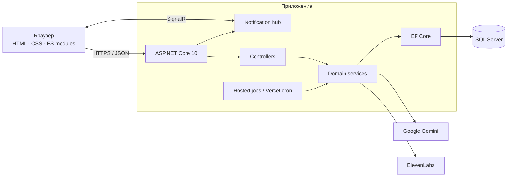

<div align="center">


# DentalClinic

**Веб-платформа стоматологической клиники: публичный сайт, личный кабинет пациента, управление работой клиники, уведомления в реальном времени и ИИ-ассистент с проверкой ответов.**

[English](README.md) · [Русский](README.ru.md)

[](https://github.com/ViolettaNcl/DentalClinic/actions/workflows/ci.yml)
[](https://github.com/ViolettaNcl/DentalClinic/actions/workflows/codeql.yml)
[](https://github.com/ViolettaNcl/DentalClinic/actions/workflows/production-smoke.yml)
[](https://dotnet.microsoft.com/)
[](LICENSE)

[Открыть приложение](https://dental-clinic-vn.vercel.app/) · [Документация](docs/README.ru.md) · [Архитектура](docs/ARCHITECTURE.md) · [API](docs/API.md) · [Участие в разработке](CONTRIBUTING.md)

</div>


## Что демонстрирует проект

DentalClinic — не статичный демонстрационный лендинг, а сквозная система для работы клиники. Она связывает обращение пациента с планированием приёма, административными процессами, сохраняемыми уведомлениями, отчётностью и коммуникацией после визита.

| Область | Возможности |
|---|---|
| Публичный сайт | Каталог услуг, профили врачей, отзывы, контакты и карта, гостевая запись, пять языков интерфейса и RTL для арабского |
| Кабинет пациента | Регистрация и защищённая сессия, профиль и аватар, история записей, правила переноса/отмены, отзывы, realtime-уведомления |
| Работа клиники | CRM заявок, управление врачами и услугами, календарь доступности, модерация отзывов, аналитика, XLSX и печатные отчёты |
| Администрирование | Несколько администраторов, права суперадминистратора, смена паролей, повышение/понижение и защита последнего суперадминистратора |
| Ассистент «Дента» | База знаний из SQL, структурированные ответы Gemini, разрешённые локальные ссылки, перевод в сценарий записи, опциональная озвучка ElevenLabs |
| Автоматизация | Напоминания и сообщения после визита, отдельно включаемая отмена устаревших заявок, удаление данных чата через защищённый cron-маршрут |

## Инженерные особенности

- **Защищённые браузерные сессии:** JWT передаётся в cookie `HttpOnly`, `SameSite=Strict`. Смена пароля или прав увеличивает сохранённую версию токена; другие экземпляры приложения учитывают её после истечения короткого кеша. Токен не попадает в JavaScript-хранилище или URL.
- **Многоуровневая защита:** проверки происхождения изменяющих состояние и платных ИИ-запросов, разрешённые адреса CORS, ограничения частоты в production, распределённые SQL-квоты, защитные заголовки, ограничения размера запросов и проверка сигнатур изображений.
- **Целостность данных:** миграции EF Core, ограничения и индексы в БД, сериализуемые операции планирования, обнаружение конфликтов, ключи идемпотентности и защита уникальности email между ролями.
- **Уведомления в реальном времени:** SignalR доставляет события пациентам и администраторам, а REST остаётся источником истины при первой загрузке и после восстановления соединения.
- **Контролируемая AI-интеграция:** факты клиники сначала разрешаются детерминированно из SQL/конфигурации; Gemini работает за границей структурированного ответа и правил безопасности медицинского ассистента.
- **Автоматические проверки:** модульные и интеграционные .NET-тесты, регрессионные JS-тесты, Playwright, CodeQL, сборка контейнера и проверки состояния опубликованного приложения.

## Архитектура



Проект организован как модульный монолит: один сервис ASP.NET Core отдаёт статический frontend, REST API, SignalR hub, фоновые процессы и доступ к БД. Подробности и архитектурные решения — в [руководстве по архитектуре](docs/ARCHITECTURE.md).

## Технологии

| Слой | Технологии |
|---|---|
| Backend | C#, ASP.NET Core 10, REST controllers, hosted services |
| Хранение данных | Entity Framework Core 10, SQL Server, code-first migrations |
| Аутентификация | JWT Bearer validation, защищённая cookie, BCrypt |
| Realtime | ASP.NET Core SignalR |
| AI | Google Gemini для структурированной генерации и перевода, опциональный ElevenLabs TTS |
| Frontend | Семантический HTML, модульный Vanilla JS, CSS по компонентам/страницам, JSON i18n |
| Доставка | Docker, Vercel container service, GitHub Actions, GHCR, опциональный FTPS fallback |
| Качество | xUnit, `WebApplicationFactory`, Node test runner, Playwright, axe-core, CodeQL |

## Быстрый старт

### Требования

- [.NET SDK 10](https://dotnet.microsoft.com/download/dotnet/10.0)
- SQL Server 2019+ или Azure SQL
- Git
- Опционально: Node.js 22 для frontend/E2E-тестов; Docker Desktop для контейнерного запуска

### Запуск через .NET SDK

```bash
git clone https://github.com/ViolettaNcl/DentalClinic.git
cd DentalClinic
dotnet tool restore
cp appsettings.Example.json appsettings.json
```

В PowerShell можно использовать `Copy-Item appsettings.Example.json appsettings.json`. Перед запуском замените примеры базы данных, JWT, разрешённых origin и профиля клиники. Реальные секреты нельзя коммитить.

```bash
dotnet restore
dotnet ef database update
dotnet run
```

Профили запуска используют `http://localhost:5192` и `https://localhost:7063`. В Development Swagger UI доступен по `/swagger`.

### Запуск через Docker Compose

```bash
cp .env.example .env
# Замените все значения-заглушки в .env.
docker compose up --build
```

Приложение откроется на `http://localhost:8080`, SQL Server — на `localhost:1433`. Полная инструкция и решение проблем находятся в [руководстве разработчика](docs/DEVELOPER_GUIDE.md).

## Конфигурация

Во внешних переменных ASP.NET Core вложенные ключи разделяются двойным подчёркиванием: например, `Jwt__Key`.

| Параметр | Назначение | Требование |
|---|---|---|
| `ConnectionStrings__DefaultConnection` | Подключение к SQL Server | Обязательно |
| `Jwt__Key` | HMAC-секрет не короче 32 UTF-8 байт | Обязательно |
| `Jwt__Issuer`, `Jwt__Audience` | Границы проверки токена | Обязательно |
| `AllowedOrigins__0` | Доверенный origin браузера | Обязательно при раздельных origin |
| `Clinic__*` | Публичные контакты клиники и координаты | Обязательно для production-контента |
| `Scheduling__*` | Часовой пояс, рабочие часы, шаг, длительность и lead time | Рекомендуется |
| `Gemini__ApiKey` | «Дента» и перевод | Для AI-функций |
| `ElevenLabs__ApiKey` | Озвучка ответов | Опционально |
| `CRON_SECRET` | Авторизация Vercel maintenance endpoints | Обязательно на Vercel |

`appsettings.Example.json` — только схема и пример. Перед настройкой общего или production-окружения прочитайте документ [«Безопасность»](docs/SECURITY.md).

## Тестирование

```bash
dotnet test DentalClinic.Tests/DentalClinic.Tests.csproj --configuration Release
npm install
npm run test:js
npx playwright install chromium
npm run test:e2e
```

По умолчанию Playwright проверяет опубликованный сайт. Для другого разрешённого окружения задайте `BASE_URL`; некоторые проверки канонического URL всё равно ожидают production-домен.

## Эксплуатационные ограничения

«Дента» и Smile Meter — информационные функции, не средства диагностики или планирования лечения. Развёртывание требует настройки секретов, внешней БД и отдельного создания администратора. Пока нет MFA и восстановления пароля администратора; доставка SignalR между несколькими экземплярами требует дополнительной инфраструктуры. Ограничения отзыва сессий, загрузок, прокси и хранения данных описаны в [руководстве по безопасности](docs/SECURITY.md).

## Документация

[Каталог документации](docs/README.ru.md) отделяет актуальные руководства от исторических инженерных записей.

| Документ | Содержание |
|---|---|
| [Архитектура](docs/ARCHITECTURE.md) | Компоненты, границы доверия, потоки данных, модель развёртывания и решения |
| [API](docs/API.md) | Актуальные маршруты, доступ, сессии, лимиты и ошибки |
| [Словарь данных](docs/DATA_DICTIONARY.md) | Сущности, ограничения, индексы, сроки хранения и переходы состояний |
| [Руководство разработчика](docs/DEVELOPER_GUIDE.md) | Установка, конфигурация, миграции, тесты и рабочий процесс |
| [Развёртывание](docs/DEPLOYMENT.md) | Vercel, Docker, миграции БД, cron и проверка выпуска |
| [Безопасность](docs/SECURITY.md) | Границы доверия, реализованные меры, остаточные риски и сообщение об уязвимостях |
| [Руководство пользователя](docs/USER_GUIDE.md) | Сценарии посетителя и пациента |
| [Руководство администратора](docs/ADMIN_GUIDE.md) | Работа клиники и суперадминистратора |

## Состояние развёртывания

Репозиторий настроен на размещение в Vercel по ссылке выше. Автодеплой Vercel из Git **приостановлен** параметром `git.deploymentEnabled: false`. При этом push в `main` запускает GitHub Actions и может вызвать публикацию в GHCR, настроенную FTPS-доставку и обслуживание реестра образов. Это относится и к обновлению документации. Перед merge прочитайте [инструкцию по развёртыванию](docs/DEPLOYMENT.md). Доступность сайта и соответствие опубликованной версии исходному коду проверяются отдельно.

## Участие и планы

Изменения должны сохранять границы приватности, планирования, локализации и медицинской безопасности. Ознакомьтесь с [CONTRIBUTING.md](CONTRIBUTING.md), [roadmap](ROADMAP.md) и приватным процессом сообщения об уязвимостях в [SECURITY.md](SECURITY.md).

## Лицензия

Проект распространяется по [лицензии MIT](LICENSE).

<div align="center">

Автор и сопровождающий — [Violetta Nicolaou](https://github.com/ViolettaNcl). Если архитектура или документация оказались полезны, поддержите репозиторий звёздочкой.

</div>
