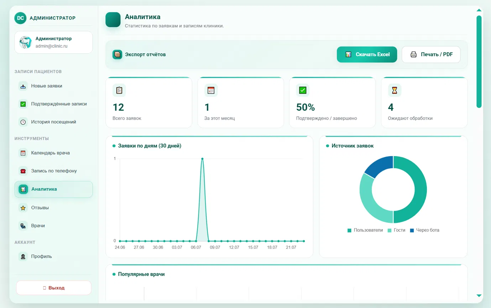

[⬅ Назад в README](../README.md)

*[🇬🇧 English version](en/ADMIN_GUIDE.md)*

# 👑 Руководство администратора

Панель администратора доступна по вкладке «Админ» после входа под учётной записью с ролью
администратора (`/api/auth/admin/login`).

## 1. Заявки на приём

- Все заявки (в том числе `pending`) видны в разделе **«Заявки»**, с фильтрами по статусу и дате.
- **Подтвердить / отменить** заявку — соответствующими кнопками; пациент мгновенно получит
  уведомление (SignalR), если он зарегистрирован.
- **Записать по телефону** — отдельная форма для случая, когда пациент позвонил и его нужно
  внести в систему вручную (эндпоинт `POST /api/appointmentrequest/admin/phone`).
- Заявки, которые провисели в статусе `pending` дольше `PendingRequestExpiryDays` дней
  (по умолчанию 14, настраивается в `appsettings.json` → `BackgroundJobs`), автоматически
  помечаются просроченными фоновой службой очистки, если она включена (`CleanupEnabled`).

## 2. Врачи

Раздел **«Врачи»**: добавление, редактирование и деактивация карточек врачей — ФИО (в том
числе переводы на 4 языка), специализация, стаж, биография. Неактивные врачи скрыты с
публичного сайта, но их история приёмов сохраняется.

## 3. Услуги и прайс-лист

Раздел **«Услуги»**: категории, название, диапазон цен (`от`–`до`), единица измерения,
ссылка на страницу услуги. Изменения сразу видны:
- на публичной странице «Услуги»;
- в ответах AI-консультанта (цены подтягиваются из БД «на лету», без перезапуска сервера).

Удаление услуги — «мягкое»: она помечается неактивной (`IsActive=false`), а не удаляется
физически, чтобы не потерять историю в старых заявках/отчётах.

## 4. Модерация отзывов

Раздел **«Отзывы»** с тремя вкладками: **на проверке / одобренные / отклонённые**.
- При отклонении обязательно укажите причину — пациент увидит её в своём кабинете.
- Одобренные отзывы сразу появляются на публичной странице отзывов.

## 5. Статистика и отчёты

Раздел **«Статистика»**:
- сводные показатели за выбранный период (количество заявок, отзывов, конверсия и т.п.);
- кнопка **«Экспорт в Excel»** — выгружает данные за период в `.xlsx` (`/api/adminstats/export/xlsx`);
- кнопка **«Печатный отчёт»** — версия для печати/PDF через браузер (`/api/adminstats/export/report`).

## 6. AI-чат-бот: мониторинг

Раздел **«AI-чат»** показывает последние сессии диалогов с ботом и статистику обращений за
период — полезно, чтобы понять, какие вопросы чаще всего задают посетители, и обновить
прайс/описания услуг под их запросы.

## 7. Профиль администратора

Смена пароля и аватара — в разделе «Профиль», аналогично кабинету пациента, но с ролью
администратора.

## 8. Ограничения и защита от злоупотреблений

Система автоматически ограничивает частоту действий (см. `docs/SECURITY.md`):
- не более 3 заявок в минуту с одного IP-адреса;
- не более 8 попыток входа в минуту с одного IP;
- не более 15 сообщений чат-боту в минуту с одного IP;
- не более 40 запросов на перевод в минуту с одного IP.

При превышении лимита пользователь увидит сообщение о временной блокировке — это ожидаемое
поведение, а не ошибка.
