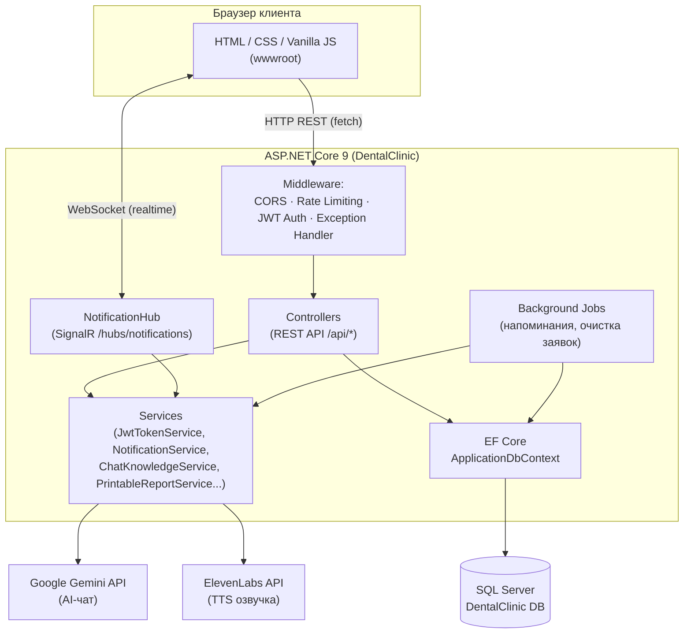
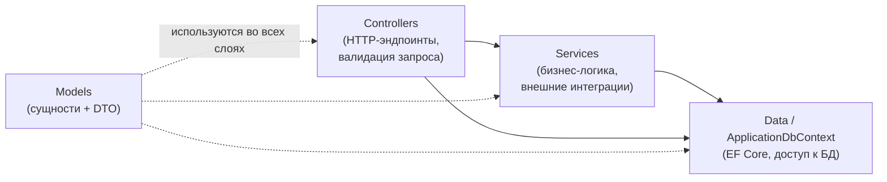
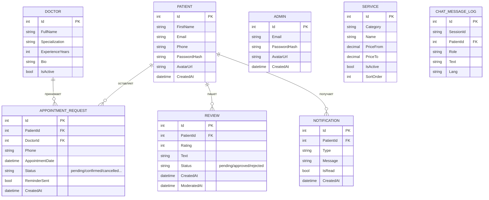
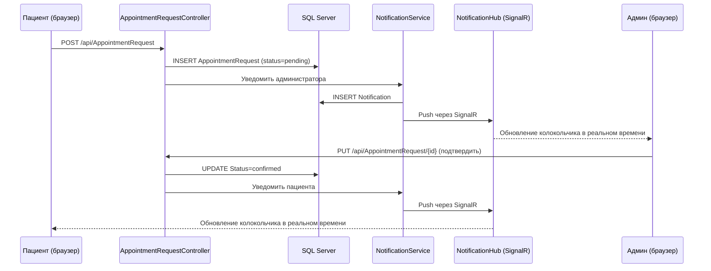
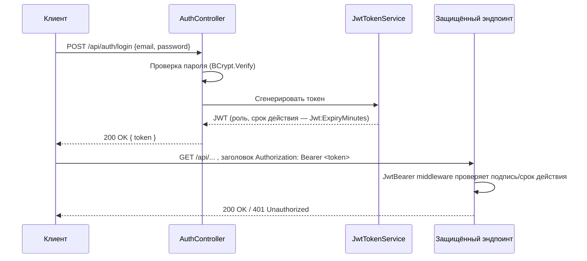

[⬅ Назад в README](../README.md)

*[🇬🇧 English version](en/ARCHITECTURE.md)*

# 🏗 Архитектура проекта

Этот документ описывает, как устроена система на верхнем уровне: из каких частей она состоит,
как они взаимодействуют, и как устроена база данных.

## 1. Общая архитектура

Проект — классическое монолитное веб-приложение на ASP.NET Core, которое одновременно:
- отдаёт статические файлы фронтенда (`wwwroot/`);
- обслуживает REST API (`Controllers/`);
- держит постоянное соединение с клиентами через SignalR (для уведомлений);
- обращается к внешним AI-сервисам (Gemini, ElevenLabs) для чат-бота.



**Почему так:** для проекта такого размера отдельный фронтенд-сервер избыточен — ASP.NET Core
отдаёт статику через `UseStaticFiles`, а фронтенд общается с бэкендом по относительным путям
(`/api/...`). Это упрощает деплой: один процесс, один порт, один хостинг.

## 2. Слои backend-приложения



- **Controllers** — тонкие контроллеры: принимают запрос, проверяют права (`[Authorize]`),
  вызывают сервисы или напрямую EF Core, возвращают ответ.
- **Services** — переиспользуемая логика: генерация JWT (`JwtTokenService`), сборка
  контекста для AI-бота из актуальных цен/врачей (`ChatKnowledgeService`), отправка
  уведомлений (`NotificationService`), выгрузка Excel-отчётов (`PrintableReportService`,
  `SimpleXlsxWriter`).
- **BackgroundJobs** — два `BackgroundService`, работающих всё время жизни приложения:
  напоминания о приёме за N часов и очистка просроченных заявок.
- **Data** — `ApplicationDbContext` (EF Core) + `DbSeeder`, который при первом запуске
  на пустой базе заполняет таблицы услуг и врачей стартовыми данными.

## 3. Модель данных (ER-диаграмма)



Ключевые индексы (заданы в `ApplicationDbContext.OnModelCreating`):
- `Review.Status` — быстрая фильтрация «на модерации»;
- `Notification(PatientId, IsRead)` — составной индекс под колокольчик уведомлений;
- `Service(Category, IsActive)` — быстрая выборка активных услуг по категории;
- `ChatMessageLog.SessionId` и `ChatMessageLog.CreatedAt` — история диалога и очистка логов.

Каскадное удаление настроено для `Review` и `Notification` при удалении `Patient`.

> 📖 Подробное описание каждого поля таблиц, точные ограничения и диаграммы состояний
> для статусов заявок/отзывов — в [`docs/DATA_DICTIONARY.md`](DATA_DICTIONARY.md).

## 4. Сценарий: запись на приём и уведомление (sequence-диаграмма)



## 5. Аутентификация (JWT)



Для SignalR токен передаётся не заголовком, а query-параметром `?access_token=`, потому что
браузерный WebSocket не может отправить произвольный HTTP-заголовок при подключении — это
настроено отдельно в `Program.cs` только для пути `/hubs/notifications`.

## 6. Многоязычность (i18n)

Файлы переводов лежат в `wwwroot/assets/i18n/{ru,en,fr,el,ar}.json` и подключаются через
`wwwroot/assets/js/core/i18n.js`. Переключение языка на лету обрабатывает
`languageSwitcher.js`, подменяя тексты по `data-i18n`-атрибутам без перезагрузки страницы.
Отзывы дополнительно переводятся «на лету» через Gemini API (`reviewTranslate.js` +
`ReviewController.TranslateReview`) с серверным кэшированием результата.

## 7. Структура репозитория

```
DentalClinic/
├── .github/
│   └── workflows/ci.yml       # GitHub Actions: сборка проекта на push/PR
├── Controllers/          # REST API эндпоинты
├── Models/                # Сущности EF Core + DTO запросов/ответов
├── Data/                  # ApplicationDbContext, DbSeeder
├── Services/               # Бизнес-логика и интеграции (JWT, чат-знания, отчёты...)
├── Hubs/                   # SignalR-хаб уведомлений
├── BackgroundJobs/         # Фоновые задачи (напоминания, очистка)
├── Properties/             # launchSettings, профили публикации
├── wwwroot/
│   ├── assets/
│   │   ├── css/            # Стили по компонентам/страницам (base/layout/components/pages)
│   │   ├── js/
│   │   │   ├── core/        # Общая инфраструктура (i18n, чат-бот, навигация...)
│   │   │   ├── managers/    # Логика конкретных страниц (admin/patient/public)
│   │   │   └── services/    # apiClient, dateUtils, realtime (SignalR-обёртка) и т.д.
│   │   └── i18n/            # JSON-словари переводов
│   ├── pages/                # HTML-страницы (услуги, врачи, кабинеты...)
│   └── uploads/avatars/       # Загруженные пользователями аватары
├── docs/
│   ├── en/                    # Английская версия всей документации
│   ├── screenshots/            # Скриншоты сайта, используемые в README и гайдах
│   └── DentalClinic.postman_collection.json  # Коллекция запросов для Postman
├── appsettings.json         # Конфигурация (⚠️ см. docs/SECURITY.md, в git не коммитится)
├── appsettings.Example.json  # Безопасный шаблон конфигурации
├── .editorconfig              # Единый стиль кода
├── Program.cs                # Точка входа, конфигурация middleware и DI
└── DentalClinic.csproj
```

## 8. Ключевые архитектурные решения

Ниже — обоснование нескольких решений, которые могут выглядеть нестандартно на первый
взгляд, но были осознанным выбором под масштаб и цели этого проекта.

**Почему фронтенд на чистом JS, а не React/Vue/Angular?**
Для проекта такого размера чистые HTML/CSS/JS без сборщиков позволяют не тратить время на
конфигурацию Webpack/Vite и деплоить сайт одним ASP.NET Core процессом, без отдельного
Node.js-сервиса. Модульность на уровне ES-модулей и разделение `core/managers/services`
даёт структуру, сравнимую с фреймворковой, но без лишних зависимостей.

**Почему нет отдельного слоя Repository поверх EF Core?**
`ApplicationDbContext` уже реализует паттерн Unit of Work (это встроено в EF Core), а
контроллеры и так достаточно тонкие. Дополнительный слой абстракции поверх `DbContext`
для проекта такого размера добавил бы сложность без ощутимой пользы — это стандартный
следующий шаг, если проект вырастет и понадобится тестировать бизнес-логику без реальной БД.

**Почему пароли хэшируются BCrypt, а не через ASP.NET Core Identity?**
ASP.NET Core Identity — полноценный фреймворк со своими таблицами, ролями и cookie-
аутентификацией «из коробки» — избыточен для двух простых ролей (пациент/админ) с JWT.
BCrypt + собственная `JwtTokenService` дают тот же уровень безопасности хэширования при
полном контроле над форматом токена и структурой таблиц.

**Самая нетривиальная инженерная задача в проекте**
Синхронизация realtime-уведомлений через SignalR с REST-эндпоинтами как резервным
каналом: колокольчик уведомлений должен корректно работать и при живом WebSocket-
соединении, и в момент его временной потери (переподключение, фоновая вкладка браузера
и т.д.), не показывая пользователю дублирующиеся или пропущенные уведомления.
