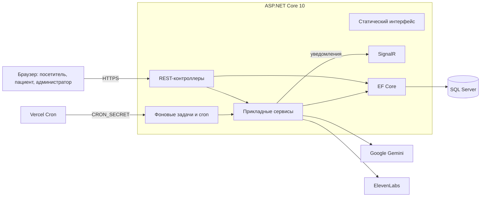
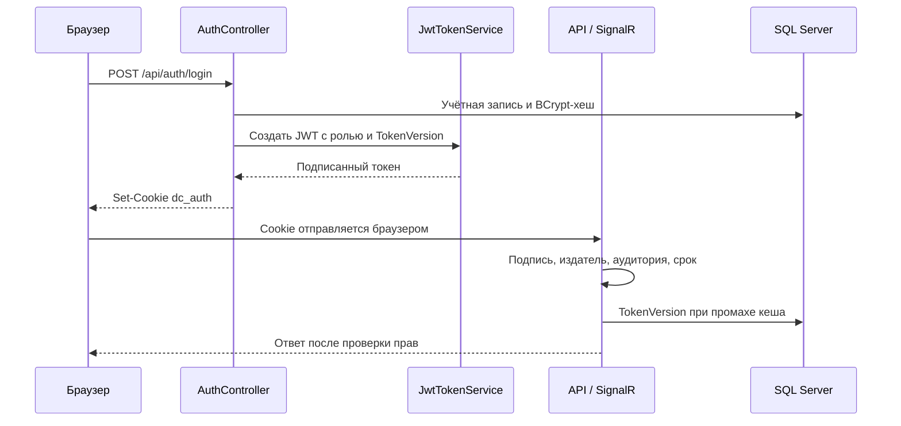
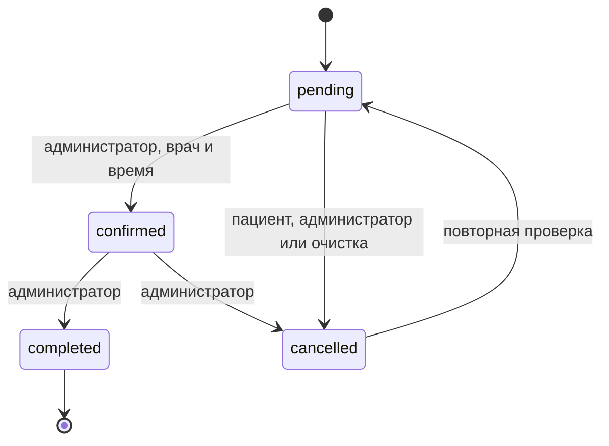
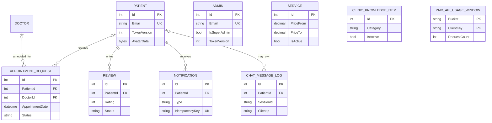

# Архитектура

[Документация](README.ru.md) · [README проекта](../README.ru.md) · [English](en/ARCHITECTURE.md)

DentalClinic — модульный монолит на ASP.NET Core 10. Один сервис обслуживает статический интерфейс, REST API, SignalR, фоновые задачи и доступ к SQL Server через EF Core. Это позволяет сохранять транзакционную целостность без распределения бизнес-процессов между отдельными сетевыми сервисами.

## Контекст системы



SQL хранит учётные записи, заявки, отзывы, уведомления, медиа, квоты и базу знаний. Gemini получает ограниченный контекст для генерации и перевода; его ответ не считается доверенным состоянием приложения. ElevenLabs используется для необязательного озвучивания.

Vercel завершает TLS и вызывает защищённые служебные маршруты. Браузерный клиент SignalR загружается с CDN; REST остаётся основным источником состояния при потере соединения.

## Компоненты

Контроллеры отвечают за HTTP-контракт, валидацию, роли, принадлежность ресурсов, статусы и передачу отмены. Простые запросы используют EF Core напрямую; общие и конкурентные операции вынесены в сервисы.

| Компонент | Ответственность |
|---|---|
| `AppointmentSchedulingService` | Время клиники, часы работы, шаг и длительность, врач, пересечения |
| `AppointmentMaintenanceService` | Напоминания, уведомления после посещения, включаемая отдельно отмена старых заявок |
| `AdminAccessService` | Права супер-администратора и последовательное выполнение административных изменений |
| `IdentityEmailGuard` | Защита уникальности email между ролями |
| `NotificationService` | Сохранение уведомлений, идемпотентность, доставка через SignalR без гарантии получения |
| `AdminAnalyticsService` | Ограниченные выборки аналитики и отчётов |
| `DentaClinicRouter`, `DentaAssistantService` | Ответы по фактам клиники и выбор пути обработки |
| `DentaAiService`, `GeminiApiKeyHandler` | Контракт провайдера, обработка ошибок, отмена и передача ключа |
| `ChatKnowledgeService` | Ограниченный и ранжированный контекст из SQL и конфигурации |
| `DistributedRequestQuotaService` | Общие для нескольких экземпляров счётчики запросов в SQL |

`ApplicationDbContext` определяет связи и ограничения. При запуске с реляционной БД миграции применяются до обслуживания запросов, затем выполняется начальное заполнение каталога и врачей.

## Интерфейс

`wwwroot/` содержит HTML, CSS и ES-модули без отдельной сборки frontend:

```text
wwwroot/
├── assets/
│   ├── css/{base,layout,components,pages,services}/
│   ├── i18n/{ru,en,fr,el,ar}.json
│   └── js/
│       ├── core/       сессия, языки, навигация, чат
│       ├── managers/   кабинеты и публичные страницы
│       └── services/   API, уведомления, перевод, общие функции
├── pages/
└── index.html
```

Запросы используют относительные URL и cookie того же происхождения. JavaScript не читает JWT.

## Конвейер запросов

Порядок в `Program.cs`:

1. Перенаправленные заголовки при `VERCEL=1`.
2. Защитные заголовки ответа и обработка исключений.
3. HSTS, перенаправление HTTPS и сжатие вне Development.
4. Статические файлы и маршрутизация.
5. Проверка происхождения изменяющих состояние запросов.
6. Ограничения тела ИИ-запросов и распределённые квоты в production.
7. CORS и локальные ограничения частоты.
8. Аутентификация и авторизация.
9. Контроллеры, SignalR и `/health`.

CORS не заменяет авторизацию. Инфраструктура должна обеспечивать достоверность перенаправленных заголовков; подробнее — в [безопасности](SECURITY.md).

## Сессии



Cookie имеет `HttpOnly`, `SameSite=Strict` и `Secure` при HTTPS. SignalR использует ту же сессию; токены в URL не принимаются.

Смена пароля или административного доступа сохраняет новую версию токена. Кеш каждого процесса может задержать её применение до 45 секунд. Выход удаляет cookie и изменяет только локальный кеш, поэтому не является долговечным глобальным отзывом токена.

## Согласованность расписания

Создание, изменение и перенос заявки используют общую проверку расписания. Сериализуемые транзакции защищают конфликтующие изменения. И `pending`, и `confirmed` занимают выбранное время врача.



В зависимости от операции уведомление сохраняется вместе с основной транзакцией или после неё. Модерация отзыва и уведомление фиксируются совместно; отправка SignalR выполняется после сохранения.

## Граница ИИ

Сначала `DentaAssistantService` проверяет возможность ответить через `DentaClinicRouter` по фактам клиники. Если требуется генерация, `DentaAiService` обращается к Gemini.

Материалы базы знаний считаются недоверенными: они очищаются, ранжируются и ограничиваются. Ответ разбирается по структуре; локальные ссылки проверяются, а намерение записи отделено от текста. Фильтры предназначены для ограничения медицинских рисков, но не гарантируют правильность ответа.

SSE передаёт текст после проверки полного ответа, а не по токенам. Решение и последствия описаны в [ADR 0001](DENTA_STREAMING_DECISION.ru.md).

## Модель данных



У заявок ссылки на пациента/врача, а у чата — на пациента допускают `SET NULL`, чтобы сохранить историю. Отзывы и уведомления удаляются каскадно с пациентом. Поля, индексы и ограничения — в [словаре данных](DATA_DICTIONARY.md).

## Фоновые задачи и доставка

В длительно работающей среде задачи обслуживания заявок выполняются фоновыми обработчиками. На Vercel они отключены: защищённые маршруты вызывает Vercel Cron.

Отдельного фонового обработчика хранения чата нет. Вне Vercel нужен планировщик для `/api/maintenance/chat-retention`. Отмена старых заявок выключена до явного включения `BackgroundJobs:CleanupEnabled=true`.

SignalR backplane не настроен. При нескольких экземплярах доставка событий между ними не гарантируется; интерфейс должен восстанавливать сохранённые уведомления через REST.

## Развёртывание

Git-triggered deployment Vercel приостановлен в `vercel.json`. Это не отключает CI/CD GitHub: push в `main` может публиковать образы GHCR, выполнять настроенную FTPS-доставку и обслуживание реестра. См. [руководство по развёртыванию](DEPLOYMENT.md).

## Структура и компромиссы

- `Controllers/`, `Models/`, `Services/` — HTTP-контракт и прикладные правила.
- `Data/`, `Migrations/` — схема, ограничения и начальное заполнение.
- `Middleware/`, `Filters/`, `Hubs/`, `BackgroundJobs/` — инфраструктурные границы.
- `DentalClinic.Tests/`, `tests/{js,e2e}/` — серверные, браузерные и сквозные проверки.
- `wwwroot/` — интерфейс; `docs/` — документация; `Program.cs` — конфигурация приложения.

Монолит упрощает транзакции и выпуск, но масштабируется как единое приложение. ES-модули не требуют отдельного frontend-конвейера, но оставляют проекту управление состоянием интерфейса. Собственная аутентификация даёт компактную модель, но проект сам отвечает за восстановление доступа, MFA и ротацию ключей.

Небольшие изображения и счётчики в SQL не зависят от временной файловой системы контейнера. При росте объёма можно рассматривать объектное хранилище за теми же границами доступа; это направление развития, не реализованная возможность.
