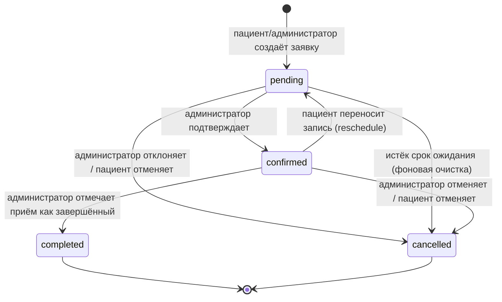
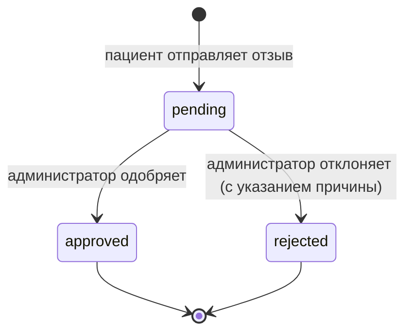

[⬅ Назад в README](../README.md)

*[🇬🇧 English version](en/DATA_DICTIONARY.md)*

# 🗂 Словарь данных (Data Dictionary)

Подробное описание каждой таблицы БД: поля, типы, ограничения, допустимые значения.
Дополняет ER-диаграмму из [`ARCHITECTURE.md`](ARCHITECTURE.md) — здесь то же самое, но на
уровне отдельных полей, с точными ограничениями из атрибутов валидации в коде.

## Patients — пациенты

| Поле | Тип | Ограничения | Описание |
|---|---|---|---|
| `Id` | `int` | PK, автоинкремент | Идентификатор |
| `FirstName` | `string` | обязательно | Имя пациента |
| `Email` | `string` | обязательно | Используется как логин |
| `Phone` | `string?` | необязательно | Контактный телефон |
| `PasswordHash` | `string` | обязательно | Хэш пароля (BCrypt), пароль в открытом виде **никогда** не хранится |
| `AvatarUrl` | `string?` | необязательно | Cache-busted URL для авторизованной выдачи аватара (`/api/avatar/content?...`) |
| `AvatarData` | `byte[]?` | необязательно | Байты аватара, устойчиво хранящиеся в SQL и не зависящие от локального диска сервера |
| `AvatarContentType` | `string?` | ≤50 симв. | MIME-тип аватара (`image/jpeg`, `image/png`, `image/webp`) |
| `TokenVersion` | `int` | по умолч. `0` | Версия сессии в JWT; увеличение сразу отзывает ранее выданные токены |
| `CreatedAt` | `DateTime` | по умолч. `UtcNow` | Дата регистрации |

## Admins — администраторы

| Поле | Тип | Ограничения | Описание |
|---|---|---|---|
| `Id` | `int` | PK | Идентификатор |
| `Email` | `string` | обязательно | Логин администратора |
| `PasswordHash` | `string` | обязательно | Хэш пароля (BCrypt) |
| `AvatarUrl` | `string?` | необязательно | Cache-busted URL для авторизованной выдачи аватара |
| `AvatarData` | `byte[]?` | необязательно | Байты аватара, устойчиво хранящиеся в SQL |
| `AvatarContentType` | `string?` | ≤50 симв. | MIME-тип сохранённого аватара |
| `TokenVersion` | `int` | по умолч. `0` | Версия сессии в JWT для немедленного отзыва старых токенов |
| `CreatedAt` | `DateTime` | по умолч. `UtcNow` | Дата создания учётной записи |

## Doctors — врачи

| Поле | Тип | Ограничения | Описание |
|---|---|---|---|
| `Id` | `int` | PK | Идентификатор |
| `FullName` | `string` | обязательно, ≤150 симв. | ФИО на русском (основной язык) |
| `FullNameEn/Fr/El/Ar` | `string?` | ≤150 симв. каждое | Переводы ФИО на 4 языка интерфейса |
| `Specialization` | `string?` | ≤300 симв. | Например: "импланты, хирургия" — используется и на сайте, и в ответах AI-бота |
| `ExperienceYears` | `int?` | необязательно | Стаж в годах |
| `Bio` | `string?` | ≤500 симв. | Краткая биография |
| `IsActive` | `bool` | по умолч. `true` | Скрытые врачи не отображаются на публичном сайте, но история приёмов сохраняется |

## AppointmentRequests — заявки на приём

| Поле | Тип | Ограничения | Описание |
|---|---|---|---|
| `Id` | `int` | PK | Идентификатор |
| `PatientId` | `int?` | FK → Patients | `null`, если заявка оставлена без регистрации |
| `FirstName` | `string?` | ≤100 симв. | Имя, если заявитель не зарегистрирован |
| `Phone` | `string` | обязательно, формат `^[\d\s\+\-\(\)]{5,20}$` | Контактный телефон |
| `AppointmentDate` | `DateTime?` | необязательно | Желаемая/подтверждённая дата приёма |
| `Comment` | `string?` | ≤500 симв. | Комментарий пациента |
| `Status` | `string` | по умолч. `"pending"` | См. диаграмму состояний ниже |
| `CreatedAt` | `DateTime` | по умолч. `UtcNow` | Дата создания заявки |
| `DoctorId` | `int?` | FK → Doctors | Врач, к которому записывается пациент |
| `ReminderSent` | `bool` | по умолч. `false` | Защита от повторной отправки напоминания фоновой службой |

**Допустимые значения `Status`:** `pending` → `confirmed` → `completed`, либо отмена в
`cancelled` на любом этапе. Подробная диаграмма переходов — ниже.

## Services — услуги / прайс-лист

| Поле | Тип | Ограничения | Описание |
|---|---|---|---|
| `Id` | `int` | PK | Идентификатор |
| `Category` | `string` | обязательно, ≤100 симв. | Группа в прайсе, например "Импланты" |
| `Name` | `string` | обязательно, ≤200 симв. | Название позиции, например "Имплант стандарт" |
| `Description` | `string?` | ≤500 симв. | Описание услуги |
| `PriceFrom` | `decimal(10,2)` | обязательно | Нижняя граница цены |
| `PriceTo` | `decimal(10,2)?` | необязательно | Верхняя граница, если указывается диапазон |
| `Unit` | `string?` | ≤30 симв. | Единица тарификации: "зуб", "канал", "челюсть" и т.п. |
| `Keywords` | `string?` | ≤300 симв. | Ключевые слова для поиска услуги AI-ботом в вопросе пациента (простой retrieval для RAG) |
| `PageUrl` | `string?` | ≤300 симв. | Ссылка на страницу услуги на сайте |
| `IsActive` | `bool` | по умолч. `true` | "Удаление" — мягкое, через флаг, а не физическое удаление строки |
| `SortOrder` | `int` | по умолч. `0` | Порядок отображения внутри категории |

## Reviews — отзывы

| Поле | Тип | Ограничения | Описание |
|---|---|---|---|
| `Id` | `int` | PK | Идентификатор |
| `PatientId` | `int` | обязательно, FK → Patients | Автор отзыва |
| `Rating` | `int` | диапазон 1–5 | Оценка |
| `Text` | `string` | обязательно, ≤1000 симв. | Текст отзыва |
| `Status` | `string` | по умолч. `"pending"` | `pending` \| `approved` \| `rejected` |
| `RejectionReason` | `string?` | ≤500 симв. | Причина отклонения, видна пациенту в кабинете |
| `CreatedAt` | `DateTime` | по умолч. `UtcNow` | Дата создания |
| `ModeratedAt` | `DateTime?` | необязательно | Дата решения модератора |
| `IsNotificationRead` | `bool` | по умолч. `false` | Прочитано ли пациентом уведомление о решении |

## Notifications — уведомления

| Поле | Тип | Ограничения | Описание |
|---|---|---|---|
| `Id` | `int` | PK | Идентификатор |
| `PatientId` | `int` | обязательно, FK → Patients | Получатель |
| `Type` | `string` | обязательно, ≤40 симв. | См. допустимые значения ниже |
| `Message` | `string` | обязательно, ≤550 симв. | Текст уведомления |
| `RelatedId` | `int?` | необязательно | ID связанной заявки/отзыва |
| `IsRead` | `bool` | по умолч. `false` | Прочитано ли |
| `CreatedAt` | `DateTime` | по умолч. `UtcNow` | Дата создания |

**Допустимые значения `Type`:** `appointment_confirmed`, `appointment_cancelled`,
`appointment_completed`, `appointment_reminder`, `review_approved`, `review_rejected`.

## ChatMessageLogs — история AI-чата

| Поле | Тип | Ограничения | Описание |
|---|---|---|---|
| `Id` | `int` | PK | Идентификатор |
| `SessionId` | `string` | обязательно, ≤64 симв. | Объединяет все сообщения одной сессии диалога |
| `PatientId` | `int?` | необязательно, FK → Patients | Если пациент авторизован во время диалога |
| `Role` | `string` | обязательно, ≤10 симв. | `"user"` (сообщение пациента) или `"bot"` (ответ Денты) |
| `Text` | `string` | обязательно, ≤1000 симв. | Текст сообщения |
| `Lang` | `string` | ≤5 симв., по умолч. `"ru"` | Язык сообщения |
| `CreatedAt` | `DateTime` | по умолч. `UtcNow` | Момент отправки |
| `ClientIp` | `string?` | ≤64 симв. | Только для защиты от накрутки статистики, в UI не показывается |

---

## Диаграмма состояний: заявка на приём

При переходе в `confirmed`/`cancelled`/`completed` пациенту автоматически уходит
уведомление (realtime через SignalR + запись в `Notifications`), а при подтверждённой
заявке фоновая служба `AppointmentReminderService` дополнительно отправит напоминание за
`ReminderHoursBefore` часов до даты приёма.

## Диаграмма состояний: модерация отзыва

Одобренные отзывы сразу становятся видны на публичной странице отзывов; отклонённые
остаются в кабинете пациента с причиной отклонения.
