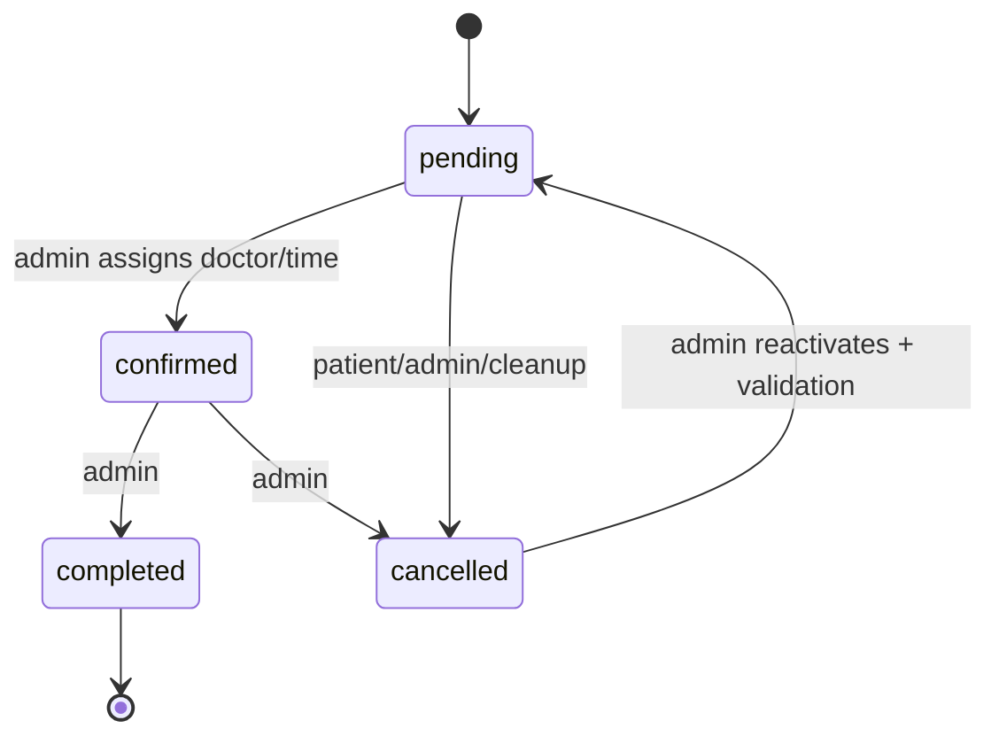
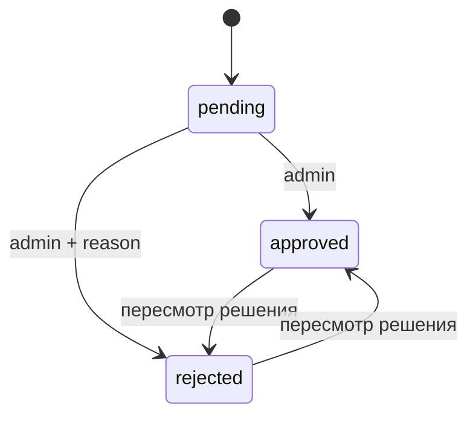

# Словарь данных

[Документация](README.ru.md) · [Архитектура](ARCHITECTURE.md) · [English](en/DATA_DICTIONARY.md)

Документ описывает модель хранения EF Core. `PK` — первичный ключ, `FK` — внешний ключ, `UK` — уникальный ключ или индекс. DTO могут задавать более строгие правила ввода, чем колонка; ограничения БД указаны отдельно.

## Patients

| Поле | Тип / предел | Правила и назначение |
|---|---|---|
| `Id` | `int` | PK, identity |
| `FirstName` | `string` | Обязательно; DTO регистрации ограничивает 100 символами |
| `Email` | `string(320)` | Обязательно, уникален среди пациентов; при входе/регистрации приводится к нижнему регистру |
| `Phone` | nullable string | Опциональный контакт |
| `PasswordHash` | string | Хеш BCrypt; открытый пароль не хранится |
| `AvatarUrl` | nullable string | Защищённый URL с версией для сброса кеша |
| `AvatarData` | nullable bytes | Байты изображения в SQL |
| `AvatarContentType` | nullable `string(50)` | `image/jpeg`, `image/png`, `image/webp` |
| `TokenVersion` | `int`, default `0` | Версия в JWT; увеличение инициирует отзыв старых сессий |
| `CreatedAt` | `datetime`, UTC now | Создание аккаунта |

`Email` имеет уникальный индекс. Уникальность между пациентами и администраторами дополнительно обеспечивается сериализованной логикой и проверками миграций.

## Admins

| Поле | Тип / предел | Правила и назначение |
|---|---|---|
| `Id` | `int` | PK, identity |
| `Email` | `string(320)` | Обязательно, уникален среди администраторов |
| `PasswordHash` | string | BCrypt hash |
| `IsSuperAdmin` | `bool` | Право управления администраторами с проверкой в БД |
| `AvatarUrl` | nullable string | Защищённый URL с версией для сброса кеша |
| `AvatarData` | nullable bytes | Изображение в SQL |
| `AvatarContentType` | nullable `string(50)` | Проверенный MIME type |
| `TokenVersion` | `int`, default `0` | Отзыв сессий |
| `CreatedAt` | `datetime`, UTC now | Создание аккаунта |

Сервис доступа запрещает удаление/понижение последнего суперадминистратора и удаление собственной учётной записи.

## Doctors

| Поле | Тип / предел | Правила и назначение |
|---|---|---|
| `Id` | `int` | PK |
| `FullName` | `string(150)` | Обязательное основное имя |
| `FullNameEn/Fr/El/Ar` | nullable `string(150)` | Локализованные имена |
| `Specialization` | nullable `string(300)` | Публичный текст и контекст ассистента |
| `ExperienceYears` | nullable `int` | Ограничение БД `0..80` |
| `Bio` | nullable `string(500)` | Краткая биография |
| `RoleTitle` | nullable `string(300)` | Заголовок подробного профиля |
| `Education`, `Skills` | nullable `string(1200)` | Многострочный текст |
| `Philosophy` | nullable `string(500)` | Публичный текст |
| `Stat2Value`, `Stat3Value` | nullable `string(40)` | Значения метрик |
| `Stat2Label`, `Stat3Label` | nullable `string(80)` | Подписи метрик |
| `PhotoUrl` | nullable `string(350)` | Маршрут с версией для сброса кеша |
| `PhotoData` | nullable bytes | Байты фотографии в SQL |
| `PhotoContentType` | nullable `string(50)` | MIME type |
| `IsActive` | `bool`, default `true` | Публичная видимость и доступность для записи |

Врача с будущими `pending`/`confirmed` приёмами нельзя деактивировать до разрешения записей.

## AppointmentRequests

| Поле | Тип / предел | Правила и назначение |
|---|---|---|
| `Id` | `int` | PK |
| `PatientId` | nullable `int` | FK → `Patients`, `SET NULL`; null для гостевой или телефонной заявки |
| `FirstName` | nullable `string(100)` | Имя контакта |
| `Phone` | `string(20)` | Обязательно; digits/spaces/`+ - ( )`, длина 5–20 |
| `AppointmentDate` | nullable `datetime` | Местное время клиники без смещения |
| `Comment` | nullable `string(500)` | Примечание |
| `Status` | `string(20)` | `pending`, `confirmed`, `cancelled`, `completed` |
| `CreatedAt` | `datetime`, UTC now | Создание заявки |
| `DoctorId` | nullable `int` | FK → `Doctors`, `SET NULL` |
| `ReminderSent` | `bool` | Сохранённый признак напоминания |
| `FollowUpSent` | `bool` | Сохранённый признак уведомления после визита |

Индексы: `(DoctorId, AppointmentDate, Status)` для поиска пересечений и `CreatedAt` для CRM, аналитики, экспорта и очистки. Конкурирующие изменения расписания в реляционной БД используют сериализуемые транзакции; `pending` и `confirmed` блокируют пересекающиеся интервалы.

Пациент самостоятельно отменяет/переносит только `pending`; изменение подтверждённой записи требует контакта с клиникой.

## Services

| Поле | Тип / предел | Правила и назначение |
|---|---|---|
| `Id` | `int` | PK |
| `Category` | `string(100)` | Обязательная группа |
| `Name` | `string(200)` | Обязательное название |
| `Description` | nullable `string(500)` | Публичный текст и контекст ассистента |
| `PriceFrom` | `decimal(10,2)` | `>= 0` |
| `PriceTo` | nullable `decimal(10,2)` | `>= PriceFrom`, если задан |
| `Unit` | nullable `string(30)` | Единица цены |
| `Keywords` | nullable `string(300)` | Ключевые слова для поиска «Денты» |
| `PageUrl` | nullable `string(300)` | Локальная страница услуги |
| `IsActive` | `bool` | Публичная видимость; удаление означает деактивацию |
| `SortOrder` | `int` | `>= 0` |

Индексы: `(Category, IsActive)` и фильтрованный UK `(PageUrl, SortOrder)` для активных строк с `PageUrl != null`, `SortOrder > 0`.

## Reviews

| Поле | Тип / предел | Правила и назначение |
|---|---|---|
| `Id` | `int` | PK |
| `PatientId` | `int` | FK → `Patients`, cascade delete |
| `Rating` | `int` | `1..5` |
| `Text` | `string(1000)` | Обязательно; DTO создания — минимум 10 символов |
| `Status` | `string(40)` | Indexed: `pending`, `approved`, `rejected` |
| `RejectionReason` | nullable `string(500)` | Обязателен при отклонении |
| `CreatedAt` | `datetime` | Время отправки |
| `ModeratedAt` | nullable `datetime` | Время решения |
| `IsNotificationRead` | `bool` | Признак прочтения решения |

Администратор может пересмотреть одобрение или отклонение. Повтор того же статуса и причины идемпотентен. Решение и уведомление сохраняются в одной транзакции; SignalR отправляется после фиксации без гарантии доставки.

## Notifications

| Поле | Тип / предел | Правила и назначение |
|---|---|---|
| `Id` | `int` | PK |
| `PatientId` | `int` | FK → `Patients`, cascade delete |
| `Type` | `string(40)` | Закрытый набор значений в БД |
| `Message` | `string(550)` | Обязательный текст |
| `RelatedId` | nullable `int` | Логическая ссылка на заявку или отзыв |
| `IdempotencyKey` | nullable `string(120)` | Фильтрованный UK для защиты от повторов |
| `IsRead` | `bool` | Признак прочтения |
| `CreatedAt` | `datetime` | Время создания |

Типы: `welcome`, `appointment_confirmed`, `appointment_cancelled`, `appointment_completed`, `appointment_reminder`, `appointment_followup`, `review_approved`, `review_rejected`. Индекс `(PatientId, IsRead)` обслуживает запросы уведомлений и непрочитанного.

## ChatMessageLogs

| Поле | Тип / предел | Правила и назначение |
|---|---|---|
| `Id` | `int` | PK |
| `SessionId` | `string(64)` | Safe ID либо стабильный SHA-256 для unusual/oversized input |
| `PatientId` | nullable `int` | FK → `Patients`, `SET NULL` |
| `Role` | `string(10)` | `user` или `bot` |
| `Text` | `string(1000)` | Сообщение ограниченной длины |
| `Lang` | `string(5)` | `ru`, `en`, `fr`, `el`, `ar`; invalid → `ru` |
| `CreatedAt` | `datetime` | Время сообщения |
| `ClientIp` | nullable `string(64)` | SHA-256 pseudonym; raw IP не сохраняется |

`SessionId` и `CreatedAt` индексированы. По умолчанию IP-псевдоним очищается через 24 часа, сообщения удаляются через 30 дней; границы настроек — 1–168 часов и 1–365 дней.

## ClinicKnowledgeItems

| Поле | Тип / предел | Правила и назначение |
|---|---|---|
| `Id` | `int` | PK |
| `Category` | `string(80)` | Обязательная группа |
| `Title` | `string(160)` | Обязательный заголовок |
| `Content` | `string(1200)` | Данные клиники |
| `Keywords` | nullable `string(300)` | Ключевые слова |
| `SortOrder` | `int` | `>= 0` |
| `IsActive` | `bool` | Доступность для поиска |
| `UpdatedAt` | `datetime` | Последнее обновление |

Индекс `(IsActive, SortOrder)`. Записи считаются недоверенными: перед составлением контекста они очищаются, ранжируются и ограничиваются по объёму.

## PaidApiUsageWindows

Историческое имя таблицы сохранено, но счётчики защищают вызовы платных провайдеров и отдельные общие маршруты.

| Поле | Тип / предел | Правила и назначение |
|---|---|---|
| `Bucket` | `string(32)` | Часть составного PK, группа квоты |
| `ClientKey` | `string(64)` | Часть составного PK, псевдоним клиента |
| `WindowStartUtc` | `datetime` | Начало фиксированного окна |
| `RequestCount` | `int` | `>= 0` |

Атомарные SQL-операции обеспечивают общую квоту для нескольких экземпляров.

Версия токена проверяется с локальным кешем на 45 секунд: отзыв сессий применяется между экземплярами не мгновенно. Очистка чата выполняется при вызове служебного маршрута: на Vercel он запланирован, для других сред нужен внешний планировщик.

## Удаление и сроки хранения

| Данные | Поведение |
|---|---|
| Patient → reviews/notifications | Каскадное удаление |
| Patient → appointments/chat logs | FK становится null, история сохраняется |
| Doctor → appointments | FK становится null |
| Services | Soft delete (`IsActive=false`) |
| Clinic knowledge | Маршрут удаления деактивирует |
| Chat IP/messages | Очистка по расписанию |
| Avatar/doctor photo | Явная замена/удаление через защищённые маршруты |

Резервное копирование и политика хранения остаются ответственностью владельца среды. Настройки приложения не заменяют требования, применимые к конкретной клинике.
