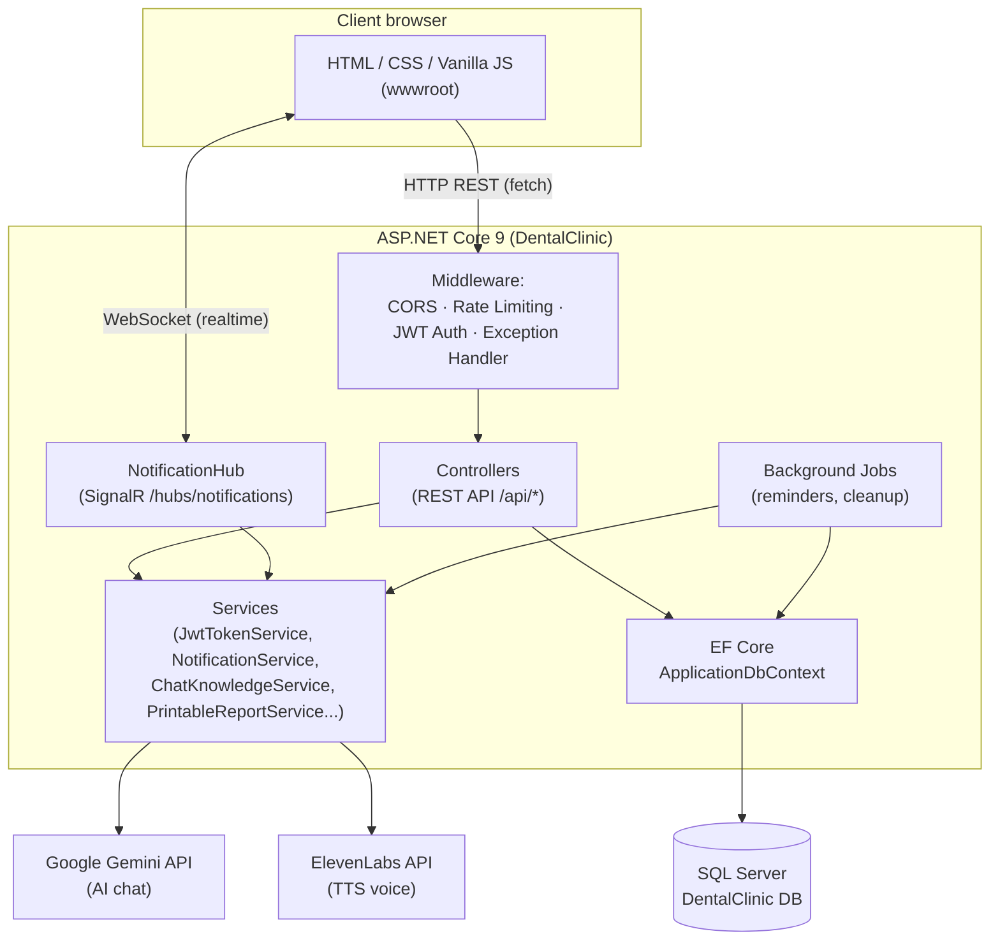
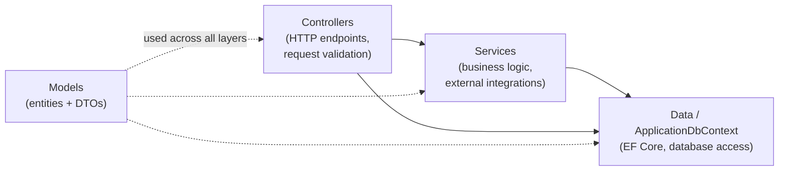
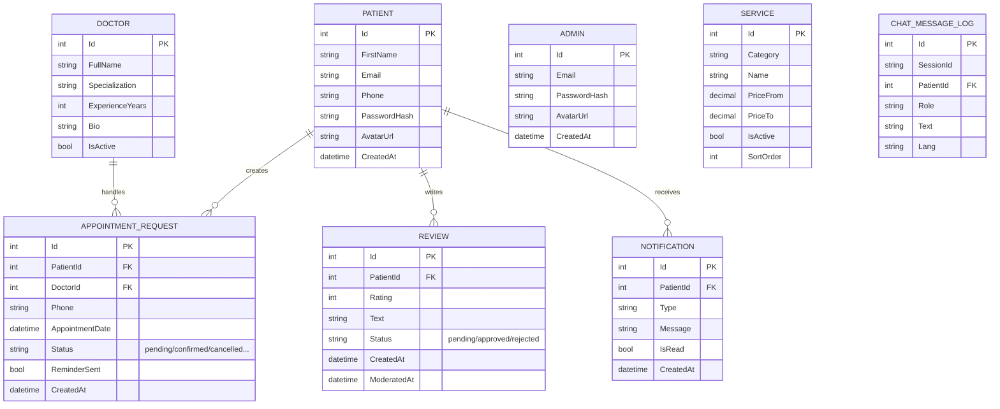
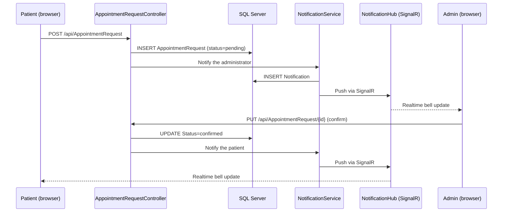
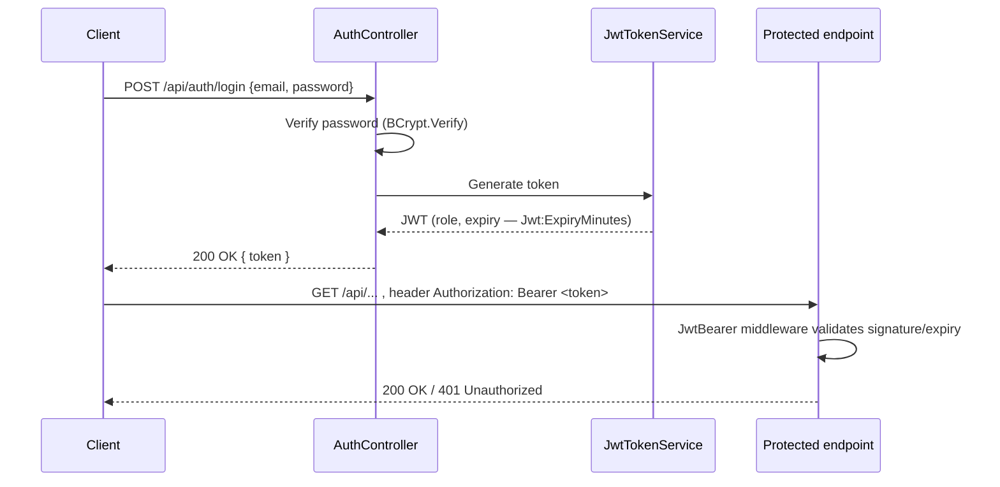

[⬅ Back to README](../../README.en.md)

# 🏗 Project Architecture

*[🇷🇺 Русская версия](../ARCHITECTURE.md)*

This document describes the system at a high level: what parts it's made of, how they
interact, and how the database is structured.

## 1. Overall architecture

The project is a classic monolithic ASP.NET Core web application that simultaneously:
- serves the frontend's static files (`wwwroot/`);
- exposes a REST API (`Controllers/`);
- keeps a persistent connection with clients via SignalR (for notifications);
- talks to external AI services (Gemini, ElevenLabs) for the chatbot.



**Why this way:** for a project of this size, a separate frontend server would be
overkill — ASP.NET Core serves static files via `UseStaticFiles`, and the frontend talks
to the backend over relative paths (`/api/...`). This simplifies deployment: a single
process, a single port, a single hosting environment.

## 2. Backend layers



- **Controllers** — thin controllers: accept the request, check permissions
  (`[Authorize]`), call services or EF Core directly, return the response.
- **Services** — reusable logic: JWT generation (`JwtTokenService`), assembling the AI
  bot's context from live prices/doctors (`ChatKnowledgeService`), sending notifications
  (`NotificationService`), exporting Excel reports (`PrintableReportService`,
  `SimpleXlsxWriter`).
- **BackgroundJobs** — two `BackgroundService` instances running for the app's lifetime:
  appointment reminders N hours ahead, and cleanup of expired requests.
- **Data** — `ApplicationDbContext` (EF Core) + `DbSeeder`, which populates the services
  and doctors tables with starter data on first run against an empty database.

## 3. Data model (ER diagram)



Key indexes (defined in `ApplicationDbContext.OnModelCreating`):
- `Review.Status` — fast filtering for "pending moderation";
- `Notification(PatientId, IsRead)` — composite index for the notification bell;
- `Service(Category, IsActive)` — fast lookup of active services by category;
- `ChatMessageLog.SessionId` and `ChatMessageLog.CreatedAt` — conversation history and log cleanup.

Cascade delete is configured for `Review` and `Notification` when a `Patient` is deleted.

> 📖 Full field-by-field description of every table, exact constraints, and state
> diagrams for appointment/review statuses — see
> [`docs/en/DATA_DICTIONARY.md`](DATA_DICTIONARY.md).

## 4. Scenario: booking an appointment and notifications (sequence diagram)



## 5. Authentication (JWT)



For SignalR, the token is passed as a query parameter `?access_token=` instead of a
header, because a browser WebSocket can't send an arbitrary HTTP header at connection
time — this is configured separately in `Program.cs` only for the
`/hubs/notifications` path.

## 6. Internationalization (i18n)

Translation files live at `wwwroot/assets/i18n/{ru,en,fr,el,ar}.json` and are loaded via
`wwwroot/assets/js/core/i18n.js`. Live language switching is handled by
`languageSwitcher.js`, which swaps text via `data-i18n` attributes without a page reload.
Reviews are additionally translated on the fly via the Gemini API
(`reviewTranslate.js` + `ReviewController.TranslateReview`), with server-side caching of
the result.

## 7. Repository layout

```
DentalClinic/
├── .github/
│   └── workflows/ci.yml       # GitHub Actions: builds the project on push/PR
├── Controllers/          # REST API endpoints
├── Models/                # EF Core entities + request/response DTOs
├── Data/                  # ApplicationDbContext, DbSeeder
├── Services/               # Business logic and integrations (JWT, chat knowledge, reports...)
├── Hubs/                   # SignalR notification hub
├── BackgroundJobs/         # Background jobs (reminders, cleanup)
├── Properties/             # launchSettings, publish profiles
├── wwwroot/
│   ├── assets/
│   │   ├── css/            # Styles by component/page (base/layout/components/pages)
│   │   ├── js/
│   │   │   ├── core/        # Shared infrastructure (i18n, chatbot, navigation...)
│   │   │   ├── managers/    # Page-specific logic (admin/patient/public)
│   │   │   └── services/    # apiClient, dateUtils, realtime (SignalR wrapper), etc.
│   │   └── i18n/            # Translation JSON dictionaries
│   ├── pages/                # HTML pages (services, doctors, dashboards...)
│   └── uploads/avatars/       # User-uploaded avatars
├── docs/
│   ├── en/                    # English version of all documentation
│   ├── screenshots/            # Site screenshots used in the README and guides
│   └── DentalClinic.postman_collection.json  # Postman request collection
├── appsettings.json         # Configuration (⚠️ see docs/en/SECURITY.md, not committed to git)
├── appsettings.Example.json  # Safe configuration template
├── .editorconfig              # Consistent code style
├── Program.cs                # Entry point, middleware & DI configuration
└── DentalClinic.csproj
```

## 8. Key architecture decisions

A few choices below might look unconventional at first glance — here's the reasoning
behind them, given this project's scale and goals.

**Why a plain-JS frontend instead of React/Vue/Angular?**
For a project of this size, plain HTML/CSS/JS with no build tools avoids spending time
configuring Webpack/Vite and lets the site deploy as a single ASP.NET Core process, with
no separate Node.js service. Modularity at the ES-module level, with the
`core/managers/services` split, gives a structure comparable to a framework's, without
the extra dependencies.

**Why isn't there a separate Repository layer on top of EF Core?**
`ApplicationDbContext` already implements the Unit of Work pattern (built into EF Core),
and the controllers are already thin enough. An extra abstraction layer on top of
`DbContext` for a project this size would add complexity without much benefit — it's the
natural next step if the project grows and business logic needs to be tested without a
real database.

**Why are passwords hashed with BCrypt instead of ASP.NET Core Identity?**
ASP.NET Core Identity is a full framework with its own tables, roles, and cookie
authentication out of the box — overkill for two simple roles (patient/admin) with JWT.
BCrypt plus a custom `JwtTokenService` provide the same hashing security level with full
control over the token format and table structure.

**The most non-trivial engineering challenge in this project**
Synchronizing realtime notifications via SignalR with REST endpoints as a fallback
channel: the notification bell has to behave correctly both with a live WebSocket
connection and during a temporary loss of it (reconnects, a backgrounded browser tab,
etc.), without showing the user duplicate or missed notifications.
