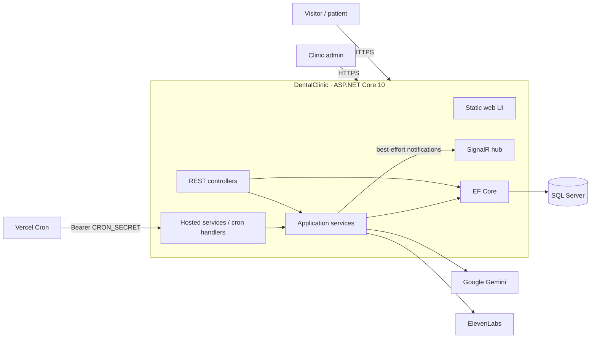
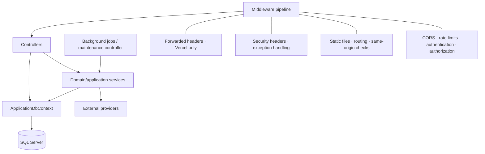
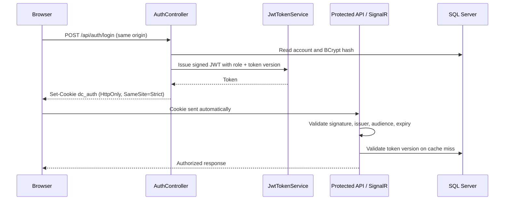
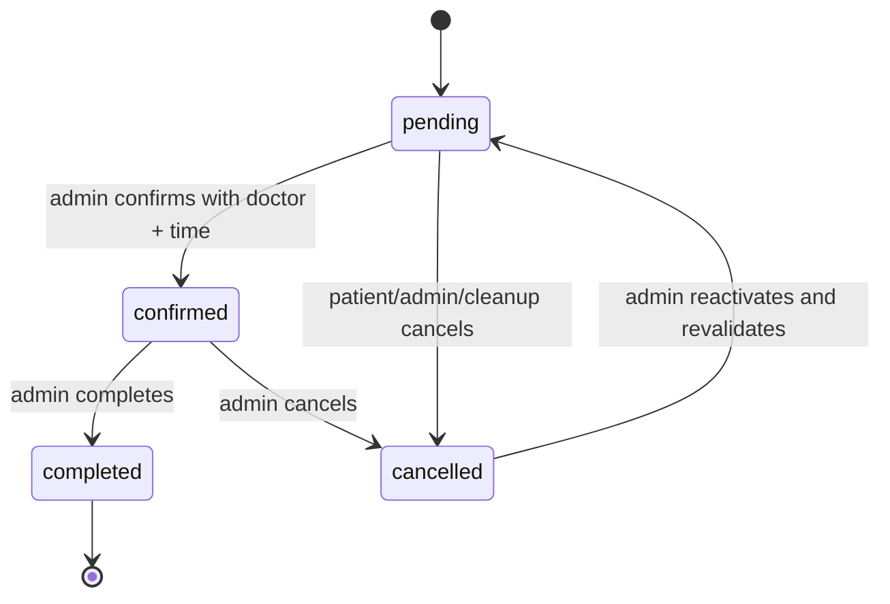
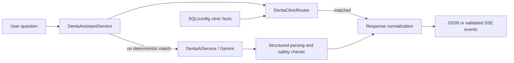
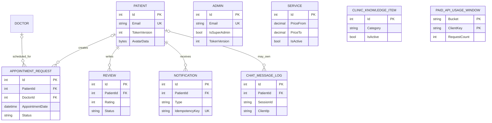
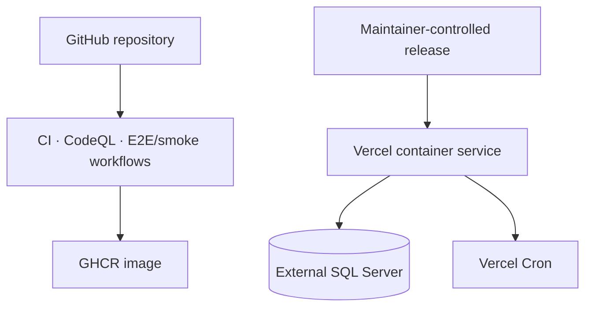

# Architecture

[Documentation](../README.md) · [Project README](../../README.md) · [Русский](../ARCHITECTURE.md)

DentalClinic is a modular monolith built on ASP.NET Core 10. One deployable service hosts the static frontend, REST API, authenticated SignalR hub, background workflows, health checks, and EF Core data access. This shape keeps operational complexity proportional to the product while preserving clear internal boundaries.

## 1. System context



### External boundaries

- **SQL Server** is the durable source of truth for clinic operations, identity records, media bytes, notifications, quotas, and managed assistant knowledge.
- **Google Gemini** receives bounded prompts for assistant generation and translation. Provider output is not trusted as application state.
- **ElevenLabs** is optional and receives bounded text for speech generation.
- **Vercel** terminates TLS, forwards the container request, and invokes protected maintenance routes when the app is deployed there.
- **SignalR's browser client** is loaded from a CDN at runtime; failure degrades realtime delivery but not the REST source of truth.

## 2. Runtime components



### Controllers

Controllers own HTTP concerns: route binding, request validation, role/ownership gates, response status, and cancellation propagation. Sensitive behavior is further enforced by services and database constraints so a controller check is not the only line of defense.

### Services

Important boundaries include:

- `AppointmentSchedulingService` — clinic-local time normalization, hours, lead time, slot alignment, doctor validation, and collision detection;
- `AppointmentMaintenanceService` — reminders, post-visit follow-ups, and explicitly enabled stale-request cleanup;
- `AdminAccessService` — super-admin authorization and serialized multi-admin mutations;
- `IdentityEmailGuard` — patient/admin cross-role email serialization;
- `NotificationService` — durable notification persistence, idempotency, and best-effort SignalR fan-out;
- `AdminAnalyticsService` — bounded dashboard/report queries;
- `DentaClinicRouter` and `DentaAssistantService` — deterministic clinic answers and provider orchestration;
- `DentaAiService` and `GeminiApiKeyHandler` — provider contract, fallback, cancellation, and protected API-key transport;
- `ChatKnowledgeService` — bounded SQL/config context for Denta;
- `DistributedRequestQuotaService` — fixed-window counters shared across production instances.

### Persistence

`ApplicationDbContext` maps the domain to SQL Server. Migrations are applied before request serving on relational startup, then `DbSeeder` inserts starter catalogue/doctor data where appropriate.

The code deliberately uses EF Core directly in simple controller queries and services for cross-cutting workflows. A generic repository wrapper would duplicate `DbContext`/`DbSet` behavior without adding a useful domain boundary at the current scale.

### Frontend

`wwwroot/` is a no-build frontend using semantic HTML, page/component CSS, and ES modules:

```text
wwwroot/
├── assets/
│   ├── css/{base,layout,components,pages,services}/
│   ├── i18n/{ru,en,fr,el,ar}.json
│   └── js/
│       ├── core/       cross-page session, i18n, navigation, chat
│       ├── managers/   admin, patient, and public page behavior
│       └── services/   API, realtime, translation, UI utilities
├── pages/
└── index.html
```

The browser uses relative URLs, credentials-enabled `fetch`, and the same-origin session cookie. Sensitive JWT material is never read by JavaScript.

## 3. Request pipeline and trust boundaries

The effective order in `Program.cs` is significant:

1. honor Vercel forwarded headers when `VERCEL=1`;
2. add security response headers;
3. normalize unhandled/transient database failures;
4. enforce HSTS/HTTPS and response compression outside Development;
5. serve default/static files and route the request;
6. reject unsafe cross-origin cookie mutations;
7. bound paid-AI payloads and enforce paid/general distributed quotas in production;
8. apply the configured CORS policy and process-local rate limits;
9. authenticate the JWT and authorize the endpoint;
10. map controllers, SignalR, and `/health`.

Defense-in-depth matters here: CORS is a browser policy, not authorization. The same-origin middleware independently rejects forged or missing origin evidence on sensitive production requests.

## 4. Session architecture



The same cookie authenticates SignalR negotiation. The application intentionally does not accept JWTs from query strings. Logout clears the browser cookie and updates a process-local cache, but does not persist a token-version increment. It is not durable cross-instance revocation. Password and administrator-access changes persist a version increment; other instances may retain the old version for up to 45 seconds.

## 5. Appointment consistency

Appointment creation/update runs centralized scheduling validation. Relational mutations that can race use serializable transactions, and both `pending` and `confirmed` rows reserve a doctor's time window.



Notifications are persisted after or with the relevant primary transaction depending on the workflow. Review moderation commits its decision and durable notification together. Non-critical realtime fan-out is best effort after durable state is safe.

## 6. Denta AI boundary



Key properties:

- clinic facts are taken from public projections, configuration, services, doctors, and active managed knowledge rather than invented by the provider;
- administrator-managed knowledge is treated as untrusted data and is sanitized, ranked, and bounded;
- structured provider output is validated before it becomes browser-visible application data;
- local links are allow-listed and booking intent is represented separately from prose;
- healthcare-safety filters are designed to reject diagnosis, dosage/medication direction, guarantees, and unsafe emergency framing; they do not guarantee clinical correctness;
- paid routes have body limits, origin enforcement, process-local limits, and production SQL-backed quotas.

The streaming endpoint is reliability-first: it preserves an SSE client contract but validates the complete structured provider object before emitting application events. See [`DENTA_STREAMING_DECISION.md`](../DENTA_STREAMING_DECISION.md).

## 7. Data model



`PatientId`/`DoctorId` on appointment rows and `PatientId` on chat rows use `SET NULL` semantics where history should survive account/resource removal. Reviews and notifications cascade with patient deletion. Full fields, constraints, and indexes are documented in the [data dictionary](DATA_DICTIONARY.md).

## 8. Background execution

Appointment maintenance has two execution hosts:

- **Long-lived/non-Vercel runtime:** registered `BackgroundService` workers run when enabled.
- **Vercel:** hosted workers are disabled because containers can suspend; Vercel Cron calls protected `/api/maintenance/*` endpoints.

Chat retention is exposed through a maintenance endpoint and scheduled by Vercel Cron; no dedicated chat-retention hosted worker is registered. Other hosts need their own scheduler for this endpoint.

No SignalR backplane is configured. In multi-instance hosting, realtime delivery is not guaranteed across instances; clients must recover durable notification state through REST.

Reminder and follow-up creation uses durable flags plus unique idempotency keys so overlapping workers/cron calls remain at-most-once at the notification boundary. Stale-request cancellation is off unless `BackgroundJobs:CleanupEnabled=true`.

## 9. Deployment topology



Vercel Git-triggered deployment is currently paused in `vercel.json`. This does not disable GitHub Actions: a documentation push to `main` can still trigger container publication, configured FTPS delivery, and registry maintenance. See the [deployment guide](DEPLOYMENT.md) for the current controlled process.

## 10. Repository layout

```text
DentalClinic/
├── BackgroundJobs/          hosted maintenance loops
├── Controllers/             REST boundaries
├── Data/                    DbContext and seeding
├── Filters/                 exception and Denta safety filters
├── HealthChecks/            JSON health response
├── Hubs/                    authenticated SignalR hub
├── Middleware/              origin and browser-response protections
├── Migrations/              EF Core schema history
├── Models/                  entities and request/response DTOs
├── Services/                scheduling, auth, AI, analytics, quotas, exports
├── DentalClinic.Tests/      unit and in-memory integration tests
├── tests/{js,e2e}/          frontend contracts and Playwright production flows
├── docs/                    reference, translations, ADRs, screenshots
├── wwwroot/                 static frontend and assets
├── Program.cs               composition root and request pipeline
├── Dockerfile*              local/generic and Vercel container builds
└── vercel.json              service routing and maintenance schedules
```

## 11. Architectural trade-offs

### Modular monolith over distributed services

Clinic workflows are transactional and the current scale does not justify network boundaries between identity, appointments, notifications, and reporting. One service reduces deployment and consistency failure modes. Services can be extracted later around measured scaling or ownership needs.

### Vanilla frontend over a framework

The UI needs progressive page behavior rather than a large client-side application. ES modules and a clear `core/managers/services` split preserve structure without a separate build/deployment pipeline.

### Custom auth over ASP.NET Core Identity

The current patient/admin model is small and intentionally controlled. Custom JWT issuance provides a narrow schema, but it also means the project owns password policy, recovery, MFA, revocation, and future key rotation. Those residual responsibilities are explicit in the [security guide](SECURITY.md) and roadmap.

### SQL-backed media and quotas

Storing small bounded avatars/photos and quota windows in SQL avoids correctness depending on an ephemeral container filesystem or process-local memory. If media volume grows materially, object storage can replace the byte columns behind the same authenticated/public endpoints.
