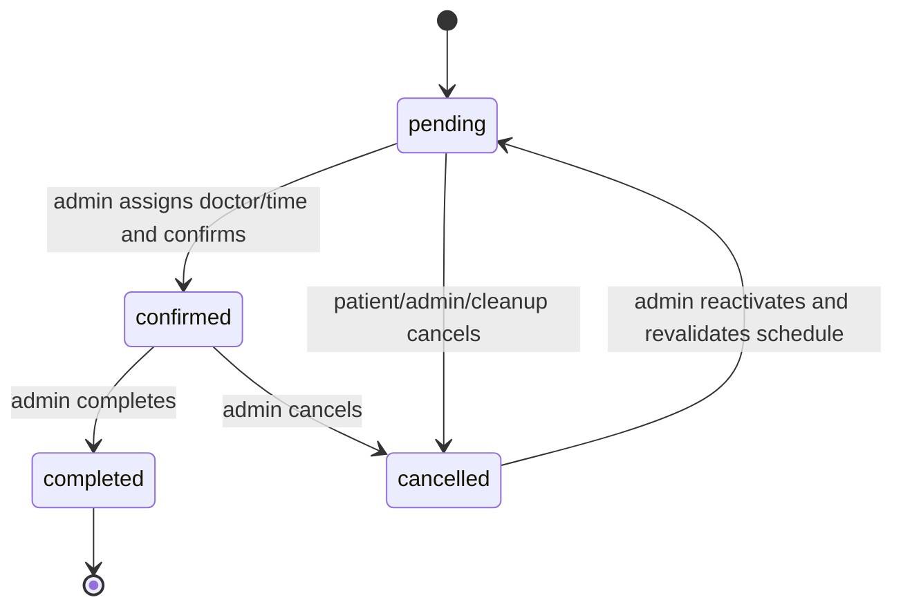
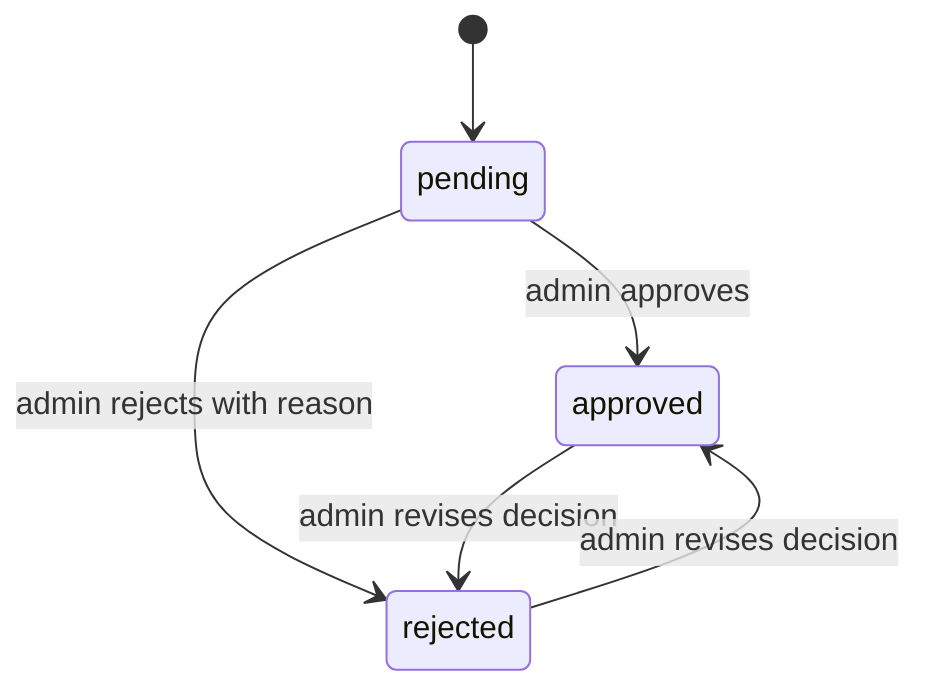

# Data dictionary

[Documentation](../README.md) · [Architecture](ARCHITECTURE.md) · [Русский](../DATA_DICTIONARY.md)

This document describes the persistent EF Core model in the current repository. `PK` means primary key, `FK` foreign key, and `UK` unique key/index. Request DTOs may enforce stricter input requirements than the stored column; database check constraints are called out explicitly.

## Patients

| Field | Type / bound | Rules and purpose |
|---|---|---|
| `Id` | `int` | PK, identity |
| `FirstName` | `string` | Required by the entity; registration DTO limits input to 100 characters |
| `Email` | `string(320)` | Required, unique per patient; normalized to lowercase by auth flows |
| `Phone` | nullable string | Optional profile contact |
| `PasswordHash` | string | BCrypt hash; plaintext is never stored |
| `AvatarUrl` | nullable string | Cache-busted authenticated URL, not the image source of truth |
| `AvatarData` | nullable bytes | Durable image bytes stored in SQL |
| `AvatarContentType` | nullable `string(50)` | `image/jpeg`, `image/png`, or `image/webp` |
| `TokenVersion` | `int`, default `0` | Embedded in JWTs; increments revoke older sessions |
| `CreatedAt` | `datetime`, default UTC now | Account creation timestamp |

`Email` has a unique index. Cross-role patient/admin identity is additionally serialized by application logic and guarded during migration because SQL Server cannot express the invariant as a simple index across two tables.

## Admins

| Field | Type / bound | Rules and purpose |
|---|---|---|
| `Id` | `int` | PK, identity |
| `Email` | `string(320)` | Required, unique per administrator |
| `PasswordHash` | string | BCrypt hash |
| `IsSuperAdmin` | `bool` | Authorizes administrator-account management after a fresh DB check |
| `AvatarUrl` | nullable string | Cache-busted authenticated URL |
| `AvatarData` | nullable bytes | Durable SQL-backed image |
| `AvatarContentType` | nullable `string(50)` | Validated image MIME type |
| `TokenVersion` | `int`, default `0` | Session-revocation version |
| `CreatedAt` | `datetime`, default UTC now | Account creation timestamp |

The access service prevents deletion/demotion of the final super-admin and prevents self-deletion.

## Doctors

| Field | Type / bound | Rules and purpose |
|---|---|---|
| `Id` | `int` | PK, identity |
| `FullName` | `string(150)` | Required primary name |
| `FullNameEn`, `FullNameFr`, `FullNameEl`, `FullNameAr` | nullable `string(150)` | Localized display names |
| `Specialization` | nullable `string(300)` | Public speciality text and assistant context |
| `ExperienceYears` | nullable `int` | DB constraint `0..80` |
| `Bio` | nullable `string(500)` | Short public biography |
| `RoleTitle` | nullable `string(300)` | Rich profile title |
| `Education`, `Skills` | nullable `string(1200)` | Normalized multiline profile content |
| `Philosophy` | nullable `string(500)` | Public profile statement |
| `Stat2Value`, `Stat3Value` | nullable `string(40)` | Optional profile metrics |
| `Stat2Label`, `Stat3Label` | nullable `string(80)` | Metric labels |
| `PhotoUrl` | nullable `string(350)` | Cache-busted public photo endpoint |
| `PhotoData` | nullable bytes | Durable photo bytes |
| `PhotoContentType` | nullable `string(50)` | Validated image MIME type |
| `IsActive` | `bool`, default `true` | Controls public visibility/booking availability |

A doctor with future `pending` or `confirmed` appointments cannot be deactivated until those bookings are resolved.

## AppointmentRequests

| Field | Type / bound | Rules and purpose |
|---|---|---|
| `Id` | `int` | PK, identity |
| `PatientId` | nullable `int` | FK → `Patients`; `SET NULL` on patient deletion; null for guest/phone workflows |
| `FirstName` | nullable `string(100)` | Guest/contact name |
| `Phone` | `string(20)` | Required; input regex accepts digits, spaces, `+ - ( )`, length 5–20 |
| `AppointmentDate` | nullable `datetime` | Clinic-local time stored without an offset |
| `Comment` | nullable `string(500)` | Patient/admin note |
| `Status` | `string(20)` | DB-constrained: `pending`, `confirmed`, `cancelled`, `completed` |
| `CreatedAt` | `datetime`, default UTC now | Request creation timestamp |
| `DoctorId` | nullable `int` | FK → `Doctors`; `SET NULL` on doctor deletion |
| `ReminderSent` | `bool`, default `false` | Durable reminder marker |
| `FollowUpSent` | `bool`, default `false` | Durable post-visit follow-up marker |

Indexes:

- `(DoctorId, AppointmentDate, Status)` supports collision/schedule queries;
- `CreatedAt` supports CRM ordering, analytics, exports, and stale-request maintenance.

The application uses serializable relational transactions around conflicting schedule mutations. `pending` and `confirmed` appointments block overlapping slots.

### Appointment state machine

Patients may cancel or reschedule only `pending` appointments through the self-service API. Confirmed changes require clinic contact.

## Services

| Field | Type / bound | Rules and purpose |
|---|---|---|
| `Id` | `int` | PK, identity |
| `Category` | `string(100)` | Required catalogue group |
| `Name` | `string(200)` | Required item name |
| `Description` | nullable `string(500)` | Public/assistant description |
| `PriceFrom` | `decimal(10,2)` | Must be non-negative |
| `PriceTo` | nullable `decimal(10,2)` | When present, must be `>= PriceFrom` |
| `Unit` | nullable `string(30)` | Billing unit |
| `Keywords` | nullable `string(300)` | Retrieval aliases for Denta |
| `PageUrl` | nullable `string(300)` | Local service page |
| `IsActive` | `bool`, default `true` | Public visibility; delete endpoint performs soft delete |
| `SortOrder` | `int`, default `0` | Non-negative ordering/fixed page slot |

Indexes:

- `(Category, IsActive)` supports the public catalogue;
- filtered UK `(PageUrl, SortOrder)` applies when `IsActive=1`, `PageUrl` is not null, and `SortOrder>0`, preventing two active services from claiming the same page slot.

## Reviews

| Field | Type / bound | Rules and purpose |
|---|---|---|
| `Id` | `int` | PK, identity |
| `PatientId` | `int` | Required FK → `Patients`; cascade delete |
| `Rating` | `int` | DB constraint `1..5` |
| `Text` | `string(1000)` | Required; create DTO requires at least 10 characters |
| `Status` | `string(40)` | Indexed and DB-constrained: `pending`, `approved`, `rejected` |
| `RejectionReason` | nullable `string(500)` | Required by workflow when rejected |
| `CreatedAt` | `datetime`, default UTC now | Submission time |
| `ModeratedAt` | nullable `datetime` | Decision time |
| `IsNotificationRead` | `bool`, default `false` | Read state for the moderation outcome in the patient dashboard |

Approved/rejected decisions can be revised; replaying the same status and rejection reason is idempotent. Moderation and the durable patient notification commit in one transaction; SignalR delivery occurs afterward on a best-effort basis.

## Notifications

| Field | Type / bound | Rules and purpose |
|---|---|---|
| `Id` | `int` | PK, identity |
| `PatientId` | `int` | Required FK → `Patients`; cascade delete |
| `Type` | `string(40)` | Required and DB-constrained to the closed domain below |
| `Message` | `string(550)` | Required user-facing text |
| `RelatedId` | nullable `int` | Logical appointment/review reference; not a physical FK |
| `IdempotencyKey` | nullable `string(120)` | Filtered UK; protects recurring/parallel maintenance delivery |
| `IsRead` | `bool`, default `false` | Bell read state |
| `CreatedAt` | `datetime`, default UTC now | Creation time |

Allowed types: `welcome`, `appointment_confirmed`, `appointment_cancelled`, `appointment_completed`, `appointment_reminder`, `appointment_followup`, `review_approved`, `review_rejected`.

Index `(PatientId, IsRead)` supports unread counts and patient notification lists.

## ChatMessageLogs

| Field | Type / bound | Rules and purpose |
|---|---|---|
| `Id` | `int` | PK, identity |
| `SessionId` | `string(64)` | Required; safe IDs are retained, unusual/oversized values become a stable SHA-256 hash |
| `PatientId` | nullable `int` | FK → `Patients`; `SET NULL` on deletion |
| `Role` | `string(10)` | DB-constrained: `user` or `bot` |
| `Text` | `string(1000)` | Required bounded message text |
| `Lang` | `string(5)` | DB-constrained: `ru`, `en`, `fr`, `el`, `ar`; invalid values normalize to `ru` |
| `CreatedAt` | `datetime`, default UTC now | Message time |
| `ClientIp` | nullable `string(64)` | SHA-256 pseudonym; raw IP is never persisted |

`SessionId` and `CreatedAt` are indexed. Default retention clears IP pseudonyms after 24 hours and deletes message rows after 30 days; configuration clamps these to 1–168 hours and 1–365 days respectively.

## ClinicKnowledgeItems

| Field | Type / bound | Rules and purpose |
|---|---|---|
| `Id` | `int` | PK, identity |
| `Category` | `string(80)` | Required grouping |
| `Title` | `string(160)` | Required administrator-facing title |
| `Content` | `string(1200)` | Required clinic fact/instruction data |
| `Keywords` | nullable `string(300)` | Query matching terms |
| `SortOrder` | `int` | Non-negative DB constraint |
| `IsActive` | `bool`, default `true` | Only active rows are eligible for retrieval |
| `UpdatedAt` | `datetime`, default UTC now | Last update timestamp |

Index `(IsActive, SortOrder)` supports bounded retrieval. The service considers managed rows untrusted, sanitizes them, ranks them against the user query, and applies configured/hard limits before prompt construction.

## PaidApiUsageWindows

The historical table name remains, but the counters now protect both paid-provider and selected general routes in production.

| Field | Type / bound | Rules and purpose |
|---|---|---|
| `Bucket` | `string(32)` | Composite PK part; quota family such as `chat`, `tts`, `translate`, `auth` |
| `ClientKey` | `string(64)` | Composite PK part; pseudonymous hash of client address |
| `WindowStartUtc` | `datetime` | Fixed-window start |
| `RequestCount` | `int` | DB constraint `>= 0` |

Atomic SQL updates make the counter effective across multiple application instances.

Token-version validation uses a 45-second process-local cache, so stored revocation changes are not instantaneous across instances. Chat retention runs only when its maintenance endpoint is invoked; Vercel schedules it, while other hosts need an external scheduler.

## Delete and retention behavior

| Relationship/data | Behavior |
|---|---|
| Patient → reviews/notifications | Cascade delete |
| Patient → appointments/chat logs | Set FK to null, retaining operational/history rows |
| Doctor → appointments | Set FK to null |
| Services | Soft delete through `IsActive=false` |
| Clinic knowledge | Delete endpoint deactivates through `IsActive=false` |
| Chat IP pseudonyms/messages | Scheduled retention cleanup |
| Avatar/doctor photo bytes | Explicit replacement/deletion through authenticated/admin endpoints |

Production backup and legal retention policy remain deployment/operator responsibilities; application defaults are not a substitute for a jurisdiction-specific data policy.
