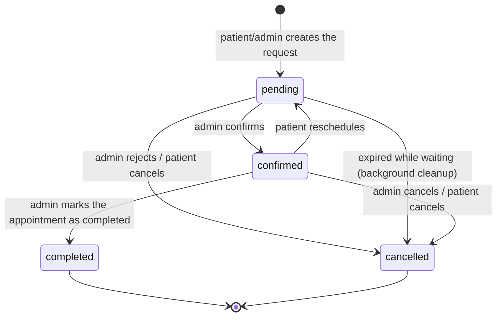
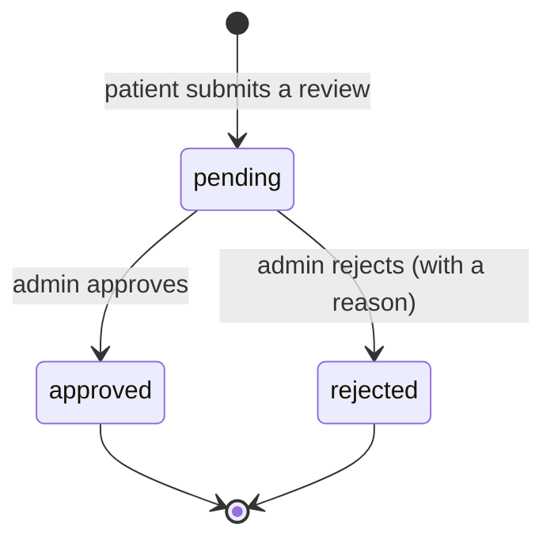

[⬅ Back to README](../../README.en.md)

*[🇷🇺 Русская версия](../DATA_DICTIONARY.md)*

# 🗂 Data Dictionary

A detailed description of every database table: fields, types, constraints, and allowed
values. This complements the ER diagram in [`ARCHITECTURE.md`](ARCHITECTURE.md) — same
information, but at the field level, with exact constraints taken from the validation
attributes in the code.

## Patients

| Field | Type | Constraints | Description |
|---|---|---|---|
| `Id` | `int` | PK, auto-increment | Identifier |
| `FirstName` | `string` | required | Patient's first name |
| `Email` | `string` | required | Used as the login |
| `Phone` | `string?` | optional | Contact phone |
| `PasswordHash` | `string` | required | Password hash (BCrypt); the plain-text password is **never** stored |
| `AvatarUrl` | `string?` | optional | Link to the avatar file in `wwwroot/uploads/avatars/` |
| `CreatedAt` | `DateTime` | defaults to `UtcNow` | Registration date |

## Admins

| Field | Type | Constraints | Description |
|---|---|---|---|
| `Id` | `int` | PK | Identifier |
| `Email` | `string` | required | Admin login |
| `PasswordHash` | `string` | required | Password hash (BCrypt) |
| `AvatarUrl` | `string?` | optional | Avatar shown in the admin panel |
| `CreatedAt` | `DateTime` | defaults to `UtcNow` | Account creation date |

## Doctors

| Field | Type | Constraints | Description |
|---|---|---|---|
| `Id` | `int` | PK | Identifier |
| `FullName` | `string` | required, ≤150 chars | Full name in Russian (primary language) |
| `FullNameEn/Fr/El/Ar` | `string?` | ≤150 chars each | Full name translated into the 4 UI languages |
| `Specialization` | `string?` | ≤300 chars | E.g. "implants, surgery" — used both on the site and in the AI bot's replies |
| `ExperienceYears` | `int?` | optional | Years of experience |
| `Bio` | `string?` | ≤500 chars | Short bio |
| `IsActive` | `bool` | defaults to `true` | Hidden doctors don't appear on the public site, but their appointment history is kept |

## AppointmentRequests

| Field | Type | Constraints | Description |
|---|---|---|---|
| `Id` | `int` | PK | Identifier |
| `PatientId` | `int?` | FK → Patients | `null` if the request was made without registering |
| `FirstName` | `string?` | ≤100 chars | Name, if the requester isn't registered |
| `Phone` | `string` | required, pattern `^[\d\s\+\-\(\)]{5,20}$` | Contact phone |
| `AppointmentDate` | `DateTime?` | optional | Desired/confirmed appointment date |
| `Comment` | `string?` | ≤500 chars | Patient's comment |
| `Status` | `string` | defaults to `"pending"` | See the state diagram below |
| `CreatedAt` | `DateTime` | defaults to `UtcNow` | Creation date |
| `DoctorId` | `int?` | FK → Doctors | The doctor the patient is booking with |
| `ReminderSent` | `bool` | defaults to `false` | Prevents the background service from sending a duplicate reminder |

**Allowed `Status` values:** `pending` → `confirmed` → `completed`, or cancellation to
`cancelled` at any stage. See the full transition diagram below.

## Services

| Field | Type | Constraints | Description |
|---|---|---|---|
| `Id` | `int` | PK | Identifier |
| `Category` | `string` | required, ≤100 chars | Price-list group, e.g. "Implants" |
| `Name` | `string` | required, ≤200 chars | Item name, e.g. "Standard implant" |
| `Description` | `string?` | ≤500 chars | Service description |
| `PriceFrom` | `decimal(10,2)` | required | Lower price bound |
| `PriceTo` | `decimal(10,2)?` | optional | Upper bound, if a range is given |
| `Unit` | `string?` | ≤30 chars | Billing unit: "tooth", "canal", "jaw", etc. |
| `Keywords` | `string?` | ≤300 chars | Keywords the AI bot uses to match this service to a patient's question (simple RAG-style retrieval) |
| `PageUrl` | `string?` | ≤300 chars | Link to the service's page on the site |
| `IsActive` | `bool` | defaults to `true` | "Deletion" is soft — via this flag, not a physical row delete |
| `SortOrder` | `int` | defaults to `0` | Display order within the category |

## Reviews

| Field | Type | Constraints | Description |
|---|---|---|---|
| `Id` | `int` | PK | Identifier |
| `PatientId` | `int` | required, FK → Patients | Review author |
| `Rating` | `int` | range 1–5 | Rating |
| `Text` | `string` | required, ≤1000 chars | Review text |
| `Status` | `string` | defaults to `"pending"` | `pending` \| `approved` \| `rejected` |
| `RejectionReason` | `string?` | ≤500 chars | Rejection reason, visible to the patient in their dashboard |
| `CreatedAt` | `DateTime` | defaults to `UtcNow` | Creation date |
| `ModeratedAt` | `DateTime?` | optional | Moderation decision date |
| `IsNotificationRead` | `bool` | defaults to `false` | Whether the patient has read the moderation-decision notification |

## Notifications

| Field | Type | Constraints | Description |
|---|---|---|---|
| `Id` | `int` | PK | Identifier |
| `PatientId` | `int` | required, FK → Patients | Recipient |
| `Type` | `string` | required, ≤40 chars | See allowed values below |
| `Message` | `string` | required, ≤550 chars | Notification text |
| `RelatedId` | `int?` | optional | ID of the related request/review |
| `IsRead` | `bool` | defaults to `false` | Read status |
| `CreatedAt` | `DateTime` | defaults to `UtcNow` | Creation date |

**Allowed `Type` values:** `appointment_confirmed`, `appointment_cancelled`,
`appointment_completed`, `appointment_reminder`, `review_approved`, `review_rejected`.

## ChatMessageLogs

| Field | Type | Constraints | Description |
|---|---|---|---|
| `Id` | `int` | PK | Identifier |
| `SessionId` | `string` | required, ≤64 chars | Groups all messages from one conversation session |
| `PatientId` | `int?` | optional, FK → Patients | Set if the patient was logged in during the conversation |
| `Role` | `string` | required, ≤10 chars | `"user"` (patient message) or `"bot"` (Denta's reply) |
| `Text` | `string` | required, ≤1000 chars | Message text |
| `Lang` | `string` | ≤5 chars, defaults to `"ru"` | Message language |
| `CreatedAt` | `DateTime` | defaults to `UtcNow` | Timestamp |
| `ClientIp` | `string?` | ≤64 chars | Only used for abuse protection, not shown in the UI |

---

## State diagram: appointment request

On transitioning to `confirmed`/`cancelled`/`completed`, the patient automatically
receives a notification (realtime via SignalR + a row in `Notifications`), and for
confirmed appointments, the `AppointmentReminderService` background job additionally
sends a reminder `ReminderHoursBefore` hours ahead of the appointment date.

## State diagram: review moderation

Approved reviews become visible on the public reviews page immediately; rejected ones
stay in the patient's dashboard along with the rejection reason.
